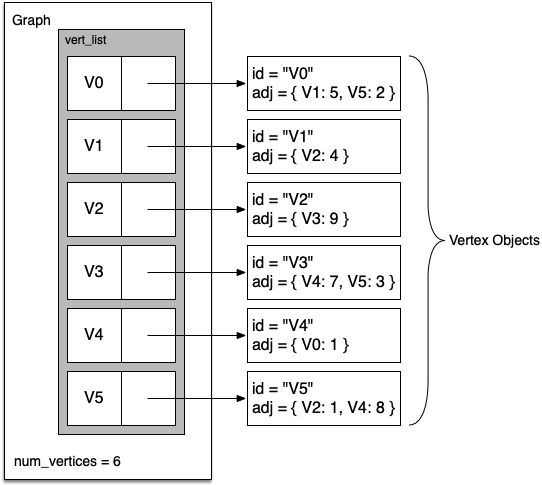

# 7.5. 邻接表

**7.5. An Adjacency List**

=== "中文"

    A more space-efficient way to implement a sparsely connected graph is to use an adjacency list. In an adjacency list implementation, we keep a master list of all the vertices in the ``Graph`` object, and each vertex object in the graph maintains a list of the other vertices that it is connected to. In our implementation of the ``Vertex`` class we will use a dictionary rather than a list, where the dictionary keys are the vertices and the values are the weights. `Figure 4` illustrates the adjacency list representation for the graph in `Figure 2`.
            
            
    <figure markdown="span">
        { width="300" }
        <figcaption markdown="span">Figure 4: An Adjacency List Representation of a Graph </figcaption>
    </figure>
    
    The advantage of the adjacency list implementation is that it allows us to compactly represent a sparse graph. The adjacency list also allows us to easily find all the links that are directly connected to a particular vertex.

=== "英文"

    A more space-efficient way to implement a sparsely connected graph is to use an adjacency list. In an adjacency list implementation, we keep a master list of all the vertices in the ``Graph`` object, and each vertex object in the graph maintains a list of the other vertices that it is connected to. In our implementation of the ``Vertex`` class we will use a dictionary rather than a list, where the dictionary keys are the vertices and the values are the weights. `Figure 4` illustrates the adjacency list representation for the graph in `Figure 2`.
            
            
    <figure markdown="span">
        { width="300" }
        <figcaption markdown="span">Figure 4: An Adjacency List Representation of a Graph </figcaption>
    </figure>
    
    The advantage of the adjacency list implementation is that it allows us to compactly represent a sparse graph. The adjacency list also allows us to easily find all the links that are directly connected to a particular vertex.