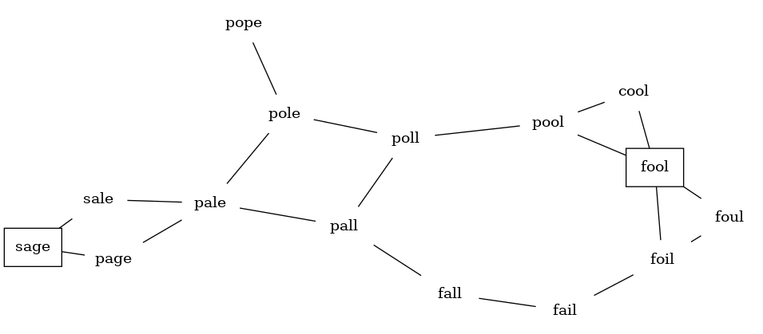
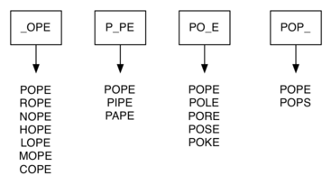

# 7.8. 构建字梯图

**7.8. Building the Word Ladder Graph**

=== "中文"

    我们面临的第一个问题是如何将大量单词转化为图。我们希望如果两个单词只相差一个字母，则在它们之间建立一条边。如果我们能创建这样的图，那么从一个单词到另一个单词的任何路径都是解决词阶梯谜题的一个解。`图 1` 显示了一个小型图，其中一些单词解决了 FOOL 到 SAGE 的词阶梯问题。注意这个图是一个无向图，边没有权重。
    
    <figure markdown="span">
        
        <figcaption markdown="span">图 1：一个小型词阶梯图</figcaption>
    </figure>
    
    我们可以使用几种不同的方法来创建解决这个问题所需的图。假设我们有一个所有单词长度相同的单词列表。作为起点，我们可以为列表中的每个单词在图中创建一个顶点。为了确定如何连接这些单词，我们可以将列表中的每个单词与其他单词进行比较。当我们比较时，我们要查看字母之间有多少个不同。如果两个单词只相差一个字母，我们就可以在它们之间创建一条边。对于一个小的单词集合，这种方法效果很好；然而，假设我们有一个 5,110 个单词的列表。大致来说，将一个单词与列表中的每个其他单词进行比较是一个 $O(n^2)$ 算法。对于 5,110 个单词，$n^2$ 是超过 2600 万次比较。
    
    我们可以通过使用 `图 2` 中展示的方法来大幅提高效率。假设我们有多个桶，每个桶上标有一个四个字母的单词，除了一个字母被替换为下划线。在处理单词列表时，我们使用下划线（\_）作为通配符，将每个单词与每个桶进行比较。每次找到一个匹配的桶时，我们将单词放入那个桶中，因此 POPE 和 POPS 都会进入 POP\_ 桶。一旦我们将所有单词放入了相应的桶中，我们知道每个桶中的所有单词必须是相互连接的。
    
    <figure markdown="span">
        
        <figcaption markdown="span">图 2：按一个字母不同的单词桶</figcaption>
    </figure>
    
    在 Python 中，我们可以使用字典来实现刚才描述的方案。我们描述的桶的标签是我们字典中的键。每个键存储的值是一个单词列表。一旦构建了字典，我们就可以创建图。我们首先为图中的每个单词创建一个顶点。然后我们为字典中同一个键下找到的所有单词之间创建边。`清单 1` 显示了构建图所需的 Python 代码。
    
    ```python title="清单 1"
    from pythonds3.graphs import Graph
    
    
    def build_graph(filename):
        buckets = {}
        the_graph = Graph()
        with open(filename, "r", encoding="utf8") as file_in:
            all_words = file_in.readlines()
        # 创建相差一个字母的单词桶
        for line in all_words:
            word = line.strip()
            for i, _ in enumerate(word):
                bucket = f"{word[:i]}_{word[i + 1 :]}"
                buckets.setdefault(bucket, set()).add(word)
    
        # 在同一个桶中的不同单词之间添加边
        for similar_words in buckets.values():
            for word1 in similar_words:
                for word2 in similar_words - {word1}:
                    the_graph.add_edge(word1, word2)
        return the_graph
    ```
    
    由于这是我们第一个实际的图问题，你可能会想知道图的稀疏程度。我们为这个问题准备的四字母单词列表共有 5,110 个单词。如果我们使用矩阵来表示这个图，它将会是一个非常稀疏的矩阵。

=== "英文"

    Our first problem is to figure out how to turn a large collection of words into a graph. What we would like is to have an edge from one word to another if the two words are only different by a single letter. If we can create such a graph, then any path from one word to another is a solution to the word ladder puzzle. `Figure 1` shows a small graph of some words that solve the FOOL to SAGE word ladder problem. Notice that the graph is an undirected graph and that the edges are unweighted.
    
    <figure markdown="span">
        
        <figcaption markdown="span">Figure 1: A Small Word Ladder Graph</figcaption>
    </figure>
    
    We could use several different approaches to create the graph we need to solve this problem. Let’s start with the assumption that we have a list of words that are all the same length. As a starting point, we can create a vertex in the graph for every word in the list. To figure out how to connect the words, we could compare each word in the list with every other. When we compare we are looking to see how many letters are different. If the two words in question are different by only one letter, we can create an edge between them in the graph. For a small set of words that approach would work fine; however, let’s suppose we have a list of 5,110 words. Roughly speaking, comparing one word to every other word on the list is an $O(n^2)$ algorithm. For 5,110 words, $n^2$ is more than 26 million comparisons.
    
    We can do much better by using the approach shown in `Figure 2`. Suppose that we have a number of buckets, each labeled with a four-letter word, except that one of the letters on the label has been replaced by an underscore. As we process a list of words, we compare each word with each bucket using the underscore (\_) as a wildcard. Every time we find a matching bucket we put the word in that bucket, so that both POPE and POPS would both go into the POP\_ bucket. Once we have all the words in the appropriate buckets, we know that all the words in each bucket must be connected.
    
    <figure markdown="span">
        
        <figcaption markdown="span">Figure 2: Word Buckets for Words That Differ by One Letter</figcaption>
    </figure>
    
    In Python, we can implement the scheme we have just described by using a dictionary. The labels on the buckets we have just described are the keys in our dictionary. The value stored for each key is a list of words. Once we have the dictionary built, we can create the graph. We start our graph by creating a vertex for each word in the graph. Then we create edges between all the vertices we find for words found under the same key in the dictionary. `Listing 1` shows the Python code required to build the graph.
    
    ```python title="Listing 1"
    from pythonds3.graphs import Graph
    
    
    def build_graph(filename):
        buckets = {}
        the_graph = Graph()
        with open(filename, "r", encoding="utf8") as file_in:
            all_words = file_in.readlines()
        # create buckets of words that differ by 1 letter
        for line in all_words:
            word = line.strip()
            for i, _ in enumerate(word):
                bucket = f"{word[:i]}_{word[i + 1 :]}"
                buckets.setdefault(bucket, set()).add(word)
    
        # add edges between different words in the same bucket
        for similar_words in buckets.values():
            for word1 in similar_words:
                for word2 in similar_words - {word1}:
                    the_graph.add_edge(word1, word2)
        return the_graph
    ```
    
    Since this is our first real-world graph problem, you might be wondering how sparse the graph is. The list of four-letter words we have for this problem is 5,110 words long. If we were to use an adjacency matrix, the matrix would have $5,110 \cdot 5,110$ = 26,112,100 cells. The graph constructed by the ``build_graph`` function has exactly 53,286 edges, so the matrix would have only 0.20% of the cells filled! That is a very sparse matrix indeed.