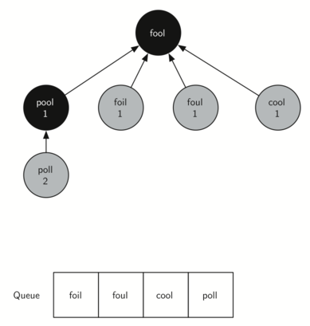

# 7.9. 实现广度优先搜索

**7.9. Implementing Breadth-First Search**

=== "中文"

    构建了图之后，我们现在可以关注用于找到单词阶梯问题最短解决方案的算法。我们将使用的图算法称为**广度优先搜索**（**BFS**），这是一个搜索图的最简单算法之一。它还作为我们稍后将研究的其他几个重要图算法的原型。
    
    给定图 $G$ 的起始顶点 $s$，广度优先搜索通过探索图中的边来查找 $G$ 中所有从 $s$ 出发的顶点。广度优先搜索的显著特点是，它会在找到任何距离 $k+1$ 的顶点之前，首先找到所有距离 $k$ 的顶点。将广度优先搜索算法的工作方式可视化的一个好方法是，想象它是在逐层构建一棵树。广度优先搜索会先添加所有起始顶点的子节点，然后再开始发现任何孙节点。
    
    为了跟踪进展，BFS 将每个顶点标记为白色、灰色或黑色。所有顶点在构造时都初始化为白色。白色顶点表示未被发现的顶点。当顶点首次被发现时，它被标记为灰色，而当 BFS 完全探索了一个顶点后，它被标记为黑色。这意味着一旦一个顶点被标记为黑色，它就没有任何相邻的白色顶点。另一方面，灰色顶点可能还有一些相邻的白色顶点，表示还有其他顶点需要探索。
    
    下列 `Listing 2` 显示了使用我们之前开发的邻接表图表示法的 BFS 算法。此外，它还使用了一个 `Queue`，这是一个关键点，我们将看到它如何决定接下来要探索哪个顶点。
    
    ```python title="Listing 2"
    from pythonds3.basic import Queue
    from pythonds3.graphs import Graph
    
    
    def bfs(start):
        start.distance = 0
        start.previous = None
        vert_queue = Queue()
        vert_queue.enqueue(start)
        while vert_queue.size() > 0:
            current = vert_queue.dequeue()
            for neighbor in current.get_neighbors():
                if neighbor.color == "white":
                    neighbor.color = "gray"
                    neighbor.distance = current.distance + 1
                    neighbor.previous = current
                    vert_queue.enqueue(neighbor)
            current.color = "black"
    ```
    
    BFS 算法使用了一个扩展版的 `Vertex` 类，该类增加了三个新的实例变量：`distance`、`previous` 和 `color`。这些实例变量都有适当的 getter 和 setter 方法。这个扩展的 `Vertex` 类的代码包含在 `pythonds3` 包中，但在这里我们不展示，因为看到这些额外的实例变量并没有新的学习内容。
    
    BFS 从起始顶点 `start` 开始，并将其标记为灰色，表示它正在被探索。起始顶点的两个其他值 `distance` 和 `previous` 分别初始化为 0 和 `None`。最后，将 `start` 放入一个 `Queue` 中。接下来的步骤是开始系统地探索队列前面的顶点。我们通过遍历其邻接表来探索队列前面的每个新节点。在检查邻接表中的每个节点时，都会检查它的颜色。如果是白色，则表示该顶点未被探索，接下来会发生四件事：
    
    1. 将新的未探索顶点 `neighbor` 标记为灰色。
    2. 将 `neighbor` 的前驱设置为当前节点 `current`。
    3. 将到 `neighbor` 的距离设置为到 `current` 的距离 + 1。
    4. 将 `neighbor` 添加到队列末尾。将 `neighbor` 添加到队列末尾有效地将该节点安排进行进一步探索，但在 `current` 的邻接表上的所有其他顶点被探索之前不会进行。
    
    让我们看看 `bfs` 函数如何构建与 `Figure 1` 中的图相对应的广度优先树。从 FOOL 开始，我们将所有与 FOOL 相邻的节点添加到树中。这些相邻节点包括 POOL、FOIL、FOUL 和 COOL。每个这些节点都被添加到新的节点队列中。`Figure 3` 显示了这一步骤后正在进行的树的状态以及队列的状态。
    
    <figure markdown="span">
        
        <figcaption markdown="span">Figure 3: The First Step in the Breadth-First Search</figcaption>
    </figure>
    
    在下一步中，`bfs` 从队列前面移除下一个节点（POOL），并对其所有相邻节点重复此过程。然而，当 `bfs` 检查节点 COOL 时，发现 COOL 的颜色已经被更改为灰色。这表明存在更短的路径到 COOL，并且 COOL 已经在队列中等待进一步扩展。在检查 POOL 时添加到队列的唯一新节点是 POLL。树和队列的新状态显示在 `Figure 4` 中。
    
    <figure markdown="span">
        
        <figcaption markdown="span">Figure 4: The Second Step in the Breadth-First Search</figcaption>
    </figure>
    
    队列中的下一个顶点是 FOIL。FOIL 唯一能添加到树中的新节点是 FAIL。当 `bfs` 继续处理队列时，接下来的两个节点都没有向队列或树中添加任何新内容。`Figure 5` 显示了在扩展树的第二层上的所有顶点后，树和队列的状态。
    
    <figure markdown="span">
        
        <figcaption markdown="span">Figure 5: Breadth-First Search Tree After Completing One Level</figcaption>
    </figure>
    
    <figure markdown="span">
        
        <figcaption markdown="span">Figure 6: Final Breadth-First Search Tree</figcaption>
    </figure>
    
    你应该继续自己完成算法的操作，以便熟悉它的工作原理。`Figure 6` 显示了所有 `Figure 3` 中的顶点扩展后的最终广度优先搜索树。广度优先搜索解决方案的惊人之处在于，我们不仅解决了最初的 FOOL-SAGE 问题，还解决了许多其他问题。我们可以从广度优先搜索树中的任何顶点开始，并沿着前驱箭头回溯到根节点，从而找到从任何单词到 FOOL 的最短单词阶梯。下面的函数（`Listing 3`）展示了如何沿着前驱链接打印出单词阶梯。
    
    ```python title="Listing 3"
    def traverse(starting_vertex):
        current = starting_vertex
        while current:
            print(current.key)
            current = current.previous
    
    traverse(g.get_vertex("sage"))
    ```

=== "英文"

    
    With the graph constructed we can now turn our attention to the algorithm we will use to find the shortest solution to the word ladder problem. The graph algorithm we are going to use is called the **breadth-first search** (**BFS**), and it is one of the easiest algorithms for searching a graph. It also serves as a prototype for several other important graph algorithms that we will study later.
    
    Given a starting vertex $s$ of a graph $G$, a breadth first search proceeds by exploring edges in the graph to find all the vertices in $G$ for which there is a path from $s$. The remarkable thing about a breadth-first search is that it finds *all* the vertices that are a distance $k$ from $s$ before it finds *any* vertices that are a distance $k+1$. One good way to visualize what the breadth-first search algorithm does is to imagine that it is building a tree, one level of the tree at a time. A breadth first search adds all children of the starting vertex before it begins to discover any of the grandchildren.
    
    To keep track of its progress, BFS colors each of the vertices white, gray, or black. All the vertices are initialized to white when they are constructed. A white vertex is an undiscovered vertex. When a vertex is initially discovered it is colored gray, and when BFS has completely explored a vertex it is colored black. This means that once a vertex is colored black, it has no white vertices adjacent to it. A gray node, on the other hand, may have some white vertices adjacent to it, indicating that there are still additional vertices to explore.
    
    The breadth-first search algorithm shown in `Listing 2` below uses the adjacency list graph representation we developed earlier. In addition it uses a ``Queue``, a crucial point as we will see, to decide which vertex to explore next.
    
    ```python title="Listing 2"
    from pythonds3.basic import Queue
    from pythonds3.graphs import Graph
    
    
    def bfs(start):
        start.distance = 0
        start.previous = None
        vert_queue = Queue()
        vert_queue.enqueue(start)
        while vert_queue.size() > 0:
            current = vert_queue.dequeue()
            for neighbor in current.get_neighbors():
                if neighbor.color == "white":
                    neighbor.color = "gray"
                    neighbor.distance = current.distance + 1
                    neighbor.previous = current
                    vert_queue.enqueue(neighbor)
            current.color = "black"
    ```
    
    The BFS algorithm uses an extended version of the ``Vertex`` class that adds three new instance variables: ``distance``, ``previous``, and ``color``. Each of these instance variables also has the appropriate getter and setter methods. The code for this expanded ``Vertex`` class is included in the ``pythonds3`` package, but we will not show it to you here as there is nothing new to learn by seeing the additional instance variables.
    
    BFS begins at the starting vertex ``start`` and paints it gray to show that it is currently being explored. Two other values, the ``distance`` and the ``previous``, are initialized to 0 and ``None`` respectively for the starting vertex. Finally, ``start`` is placed on a ``Queue``. The next step is to begin to systematically explore vertices at the front of the queue. We explore each new node at the front of the queue by iterating over its adjacency list. As each node on the adjacency list is examined, its color is checked. If it is white, the vertex is unexplored, and four things happen:
    
    1. The new unexplored vertex ``neighbor`` is colored gray.
    2. The predecessor of ``neighbor`` is set to the current node ``current``.
    3. The distance to ``neighbor`` is set to the distance to ``current + 1``.
    4. ``neighbor`` is added to the end of a queue. Adding ``neighbor`` to the end of the queue effectively schedules this node for further exploration, but not until all the other vertices on the adjacency list of ``current`` have been explored.
    
    Let’s look at how the ``bfs`` function would construct the breadth-first tree corresponding to the graph in `Figure 1`. Starting from FOOL we take all nodes that are adjacent to FOOL and add them to the tree. The adjacent nodes include POOL, FOIL, FOUL, and COOL. Each of these nodes are added to the queue of new nodes to expand. `Figure 3` shows the state of the in-progress tree along with the queue after this step.
    
    <figure markdown="span">
        
        <figcaption markdown="span">Figure 3: The First Step in the Breadth-First Search</figcaption>
    </figure>
    
    In the next step ``bfs`` removes the next node (POOL) from the front of the queue and repeats the process for all of its adjacent nodes. However, when ``bfs`` examines the node COOL, it finds that the color of COOL has already been changed to gray. This indicates that there is a shorter path to COOL and that COOL is already on the queue for further expansion. The only new node added to the queue while examining POOL is POLL. The new state of the tree and queue is shown in `Figure 4`.
    
    <figure markdown="span">
        
        <figcaption markdown="span">Figure 4: The Second Step in the Breadth-First Search</figcaption>
    </figure>
    
    The next vertex on the queue is FOIL. The only new node that FOIL can add to the tree is FAIL. As ``bfs`` continues to process the queue, neither of the next two nodes adds anything new to the queue or the tree. `Figure 5` shows the tree and the queue after expanding all the vertices on the second level of the tree.
    
    <figure markdown="span">
        
        <figcaption markdown="span">Figure 5: Breadth-First Search Tree After Completing One Level</figcaption>
    </figure>
    
    <figure markdown="span">
        
        <figcaption markdown="span">FIgure 6: Final Breadth-First Search Tree </figcaption>
    </figure>
    
    You should continue to work through the algorithm on your own so that you are comfortable with how it works. `Figure 6` shows the final breadth-first search tree after all the vertices in `Figure 3` have been expanded. The amazing thing about the breadth-first search solution is that we have not only solved the FOOL–SAGE problem we started out with, but we have solved many other problems along the way. We can start at any vertex in the breadth-first search tree and follow the predecessor arrows back to the root to find the shortest word ladder from any word back to FOOL. The function below (`Listing 3`) shows how to follow the predecessor links to print out the word ladder.
    
    ```python title="Listing 3"
    def traverse(starting_vertex):
        current = starting_vertex
        while current:
            print(current.key)
            current = current.previous
    
    traverse(g.get_vertex("sage"))
    ```