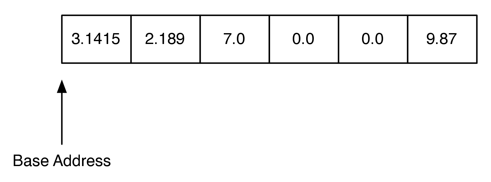

# 8.2. Python列表再探

**8.2. Python Lists Revisited**

=== "中文"

    在第2章[算法分析](../c2/index.md)中，我们介绍了 Python 列表数据类型的一些 Big-O 性能限制。然而，我们当时还没有足够的知识来理解 Python 是如何实现其列表数据类型的。在第[基本数据结构](../c3/index.md)章中，你学习了如何使用节点和引用模式来实现一个链表。然而，这种节点和引用的实现仍然无法匹配 Python 列表的性能。在本节中，我们将探讨 Python 列表实现的原理。需要注意的是，这种实现不会与 Python 的实际实现完全相同，因为 Python 列表是用 C 语言实现的。本节的目的是使用 Python 演示关键概念，而不是替代 C 语言实现。
    
    Python 列表实现的关键在于使用一种叫做 *数组* 的数据类型，这种类型在 C、C++、Java 和许多其他编程语言中都很常见。数组非常简单，只能存储一种类型的数据。例如，你可以有一个整数数组或浮点数数组，但不能在一个数组中混合这两种类型。数组只支持两种操作：索引和赋值到数组索引。
    
    最好的理解数组的方式是把它看作计算机内存中的一个连续字节块。这个块被分割成 $n$ 字节的块，其中 $n$ 取决于存储在数组中的数据类型。`图 1` 展示了一个大小为可以容纳六个浮点值的数组。
    
    <figure markdown="span">
        
        <figcaption markdown="span">图 1: 浮点数数组</figcaption>
    </figure>
    
    在 Python 中，每个浮点数使用 16 [^1] 字节的内存。因此，`图 1` 中的数组总共使用了 96 [^2] 字节。基地址是数组在内存中开始的位置。你之前见过 Python 中不同对象的地址。例如: ``<__main__.Foo object at 0x5eca30>`` 表示对象 ``Foo`` 存储在内存地址 ``0x5eca30``。地址非常重要，因为数组通过一个非常简单的计算实现索引操作：
    { .annotate }
    
    ```python
    item_address = base_address + index * size_of_object
    ```
    
    例如，假设我们的数组起始位置是 ``0x000040``，即十进制的 64。要计算数组中位置 4 的对象位置，我们只需进行算术运算：$64 + 4 \cdot 8 = 96$。显然，这种计算是 $O(1)$。当然，这也有一些风险。首先，由于数组的大小是固定的，因此不能无限期地在数组末尾添加元素，否则会带来严重的后果。其次，在某些语言中，如 C，数组的边界不会被检查，因此即使数组中只有六个元素，将值赋给索引 7 也不会导致运行时错误。正如你可能想象的那样，这可能会导致很大的问题，很难追踪。在 Linux 操作系统中，访问超出数组边界的值通常会产生不太有用的错误信息“分段错误”。
    
    Python 用于实现链表的数组策略如下：
    
    - Python 使用一个数组来存储对其他对象的引用（在 C 语言中称为 *指针*）。
    - Python 使用一种叫做 *超额分配* 的策略来分配一个比初始所需空间更多的数组。
    - 当初始数组填满后，会超额分配一个更大的数组，并将旧数组的内容复制到新数组中。
    
    这一策略的影响非常惊人。让我们先了解这些影响，然后再深入到实现或证明细节中。
    
    - 访问特定位置的项是 $O(1)$。
    - 向列表中追加元素在平均情况下是 $O(1)$，但在最坏情况下是 $O(n)$。
    - 从列表末尾弹出元素是 $O(1)$。
    - 从列表中删除项是 $O(n)$。
    - 在任意位置插入项是 $O(n)$。
    
    让我们看一下上述策略如何在一个非常简单的实现中工作。首先，我们将仅实现构造函数、``__resize`` 方法和 ``append`` 方法。我们将这个类称为 ``ArrayList``。在构造函数中，我们需要初始化两个实例变量。第一个变量用于跟踪当前数组的大小，我们称之为 ``max_size``。第二个实例变量用于跟踪列表的当前末尾，我们称之为 ``last_index``。由于 Python 没有数组数据类型，我们将使用列表来模拟数组。`Listing [lst_arraylistinit]` 包含 ``ArrayList`` 的前三个方法的代码。注意，构造函数初始化了上述两个实例变量，然后创建了一个称为 ``my_array`` 的零元素数组。构造函数还创建了一个名为 ``size_exponent`` 的实例变量。我们将很快理解这个变量的用途。
    
    ```python linenums="1"
    class ArrayList:
        def __init__(self):
            self.size_exponent = 0
            self.max_size = 0
            self.last_index = 0
            self.my_array = []
    
        def append(self, val):
            if self.last_index > self.max_size - 1:
                self.__resize()
            self.my_array[self.last_index] = val
            self.last_index += 1
    
        def __resize(self):
            new_size = 2 ** self.size_exponent
            print("new_size = ", new_size)
            new_array = [0] * new_size
            for i in range(self.max_size):  
                new_array[i] = self.my_array[i]
    
            self.max_size = new_size
            self.my_array = new_array
            self.size_exponent += 1
    ```
    
    接下来，我们将实现 ``append`` 方法。``append`` 方法的第一步是检查 ``last_index`` 是否大于数组中可用索引位置的数量（第 `9` 行）。如果是这种情况，则调用 ``__resize``。注意，我们使用双下划线约定将 ``resize`` 方法设置为私有。数组大小调整后，将新值添加到列表中的 ``last_index`` 位置，并将 ``last_index`` 增加 1。
    
    ``resize`` 方法使用 $2 ^ {size\_exponent}$ 计算数组的新大小。可以使用多种方法来调整数组大小。一些实现每次都将数组大小加倍，如我们所做的那样，一些使用 1.5 的乘数，还有一些使用二的幂。Python 使用 1.125 的乘数加上一个常量。Python 开发者设计了这种策略，以便在不同的 CPU 和内存速度的计算机上都能取得良好的平衡。Python 策略导致的数组大小序列为 $0, 4, 8, 16, 24, 32, 40, 52, 64, 76\ldots$。每次将数组大小加倍会导致更多的浪费空间，但更容易分析。一旦分配了新数组，必须将旧列表中的值复制到新数组中；这在第 `19` 行开始的循环中完成。最后，必须更新 ``max_size`` 和 ``last_index`` 的值，``size_exponent`` 必须增加，并将 ``new_array`` 保存为 ``self.my_array``。在 C 语言中，``self.my_array`` 旧的内存块会被显式地返回给系统以供重用。然而，请记住，在 Python 中，未被引用的对象会被垃圾回收算法自动清理。
    
    在继续之前，让我们分析一下为什么这种策略为 ``append`` 操作提供了平均 $O(1)$ 性能。关键在于大多数情况下，追加一个项的成本是 1。唯一的例外是当 ``last_index`` 是 2 的幂时，此时追加一个项的成本是 $O(last\_index)$。我们可以如下总结插入第 $i_{th}$ 项的成本：
    
    $$
        c_i =
        \begin{cases}
            i \text{ 如果 } i \text{ 是 2 的幂} \\
            1 \text{ 否则}
        \end{cases}
    $$
    
    由于复制 ``last_index`` 项的昂贵操作发生的频率相对较低，我们将成本分摊，或称为 *摊销*，将插入的成本分摊到所有的追加操作上。当我们这样做时，任何一次插入的平均成本为 $O(1)$。例如，考虑一种情况，假设你已经追加了四项。每次追加操作仅需一次操作来存储到已经分配的可以容纳四个项的数组中。当第五个项被添加时，会分配一个大小为 8 的新数组，并复制四个旧项。但现在你在数组中有了四个额外的低成本追加空间。数学上我们可以如下表示：
    
    $$
        \begin{aligned}
            cost_{total} &= n + \sum_{j=0}^{\log_2{n}}{2^j}  \\
                    &= n + 2n \\
                    &= 3n
        \end{aligned}
    $$
    
    上面的求和可能对你来说不太明显，因此我们可以再深入思考一下。求和从零到 $\log_2{n}$。求和的上界告诉我们需要多少次将数组大小加倍。$2^j$ 这一项表示在数组大小加倍时需要进行的复制操作。由于追加 $n$ 个项的总成本是 $3n$，单个项的成本是 $3n/n = 3$。由于成本是一个常数，我们说它是 $O(1)$。这种分析称为 **摊销分析**，在分析更复杂的算法时非常有用。
    
    接下来，我们来看看索引操作符。`Listing [lst_arrindex]` 展示了我们对数组位置的索引和赋值的 Python 实现。回顾一下，我们之前讨论过，找到数组中第 $i_{th}$ 项的内存位置所需的计算是一个简单的 $O(1)$ 算术表达式。即使像 C 这样的语言也将这一计算隐藏在一个很好的数组索引操作符后面，因此在这方面，C 和 Python 的表现非常相似。事实上，在 Python 中很难获得对象的实际内存位置用于这样的计算，因此我们将依赖列表的内置索引操作符。为了确认这一点，你可以随时查看 Python 源代码中的 ``listobject.c`` 文件。
    
    ```python 
    def __getitem__(self, idx):
        if idx < self.last_index:
            return self.my_array[idx]
        raise LookupError("index out of bounds")
    
    def __setitem__(self, idx, val):
        if idx < self.last_index:
            self.my_array[idx] = val
        raise LookupError("index out of bounds")
    ```
    
    最后，让我们看看其中一种成本较高的列表操作：插入。当我们将一个项插入 ``ArrayList`` 时，我们需要首先将插入点及其之后的所有内容向前移动一个索引位置，以为插入的项腾出空间。这个过程在 `Figure 2` 中进行了说明。
    
    <figure markdown="span">
        
        <figcaption markdown="span">图 2: 在 ArrayList 中的索引 2 处插入 27.1</figcaption>
    </figure>
    
    正确实现 ``insert`` 的关键是意识到在数组中移动值时不想覆盖任何重要数据。实现这一点的方法是从列表的末尾向插入点方向移动，向前复制数据。我们的 ``insert`` 实现如下 `Listing [lst_arrlistins]`。注意第 `4` 行的 ``range`` 设置，以确保我们首先将现有数据复制到数组的未使用部分，然后将随后的值复制到已经移动的旧值上。如果循环从插入点开始，将该值复制到数组中下一个较大的索引位置，旧值将永远丢失。
    
    ```python linenums="1"
    def insert(self, idx, val):
        if self.last_index > self.max_size - 1:
            self.__resize()
        for i in range(self.last_index, idx - 1, -1):
            self.my_array[i + 1] = self.my_array[i]
        self.last_index += 1
        self.my_array[idx] = val
    ```
    
    插入操作的性能是 $O(n)$，因为在最坏情况下，我们要在索引 0 处插入某个项，并且必须将整个数组向前移动一个位置。平均而言，我们只需要移动一半的数组，但这仍然是 $O(n)$。你可能需要回到第[基本数据结构](../c3/index.md)章，回顾一下如何使用节点和引用来完成所有这些列表操作。没有哪种实现是对的或错的；它们只是有不同的性能保证，可能根据你编写的应用程序的类型更好或更差。特别是，你是否打算经常在列表的开头添加项，还是你的应用程序在列表的末尾添加项？你会从列表中删除项，还是只向列表中添加新项？
    
    我们还有一些其他有趣的操作没有为 ``ArrayList`` 实现，包括：``pop``、``del``、``index``，以及使 ``ArrayList`` 可迭代。我们将这些改进留给你作为练习。

=== "英文"

    In Chapter [analysis](../c2/index.md) we introduced some Big-O performance limits on Python’s list data type. However, we did not yet have the knowledge necessary to understand how Python implements its list data type. in Chapter [basic-data-structures](../c3/index.md) you learned how to implement a linked list using the nodes and references pattern. However, the nodes and references implementation still did not match the performance of the Python list. In this section we will look at the principles behind the Python list implementation. It is important to recognize that this implementation is not going to be the same as Python’s since the real Python list is implemented in the C programming language. The idea in this section is to use Python to demonstrate the key ideas, not to replace the C implementation.
    
    The key to Python’s implementation of a list is to use a data type called an *array* common to C, C++, Java, and many other programming languages. The array is very simple and is only capable of storing one kind of data. For example, you could have an array of integers or an array of floating point numbers, but you cannot mix the two in a single array. The array only supports two operations: indexing and assignment to an array index.
    
    The best way to think about an array is that it is one continuous block of bytes in the computer’s memory. This block is divided up into $n$-byte chunks where $n$ is based on the data type that is stored in the array. `Figure 1` illustrates the idea of an array that is sized to hold six floating point values.
    
    <figure markdown="span">
        
        <figcaption markdown="span">Figure 1: An Array of Floating Point Numbers</figcaption>
    </figure>
    
    In Python, each floating point number uses 16 [^1] bytes of memory. So the array in `Figure 1` uses a total of 96 [^2] bytes. The base address is the location in memory where the array starts. You have seen addresses before in Python for different objects that you have defined. For example: ``<__main__.Foo object at 0x5eca30>`` shows that the object ``Foo`` is stored at memory address ``0x5eca30``. The address is very important because an array implements the index operator using a very simple calculation:
    { .annotate }
    
    ```python
    item_address = base_address + index * size_of_object
    ```
    
    For example, suppose that our array starts at location ``0x000040``, which is 64 in decimal. To calculate the location of the object at position 4 in the array we simply do the arithmetic: $64 + 4 \cdot 8 = 96$. Clearly this kind of calculation is $O(1)$. Of course this comes with some risks. First, since the size of an array is fixed, one cannot just add things on to the end of the array indefinitely without some serious consequences. Second, in some languages, like C, the bounds of the array are not even checked, so even though your array has only six elements in it, assigning a value to index 7 will not result in a runtime error. As you might imagine this can cause big problems that are hard to track down. In the Linux operating system, accessing a value that is beyond the boundaries of an array will often produce the rather uninformative error message “segmentation violation.”
    
    The general strategy that Python uses to implement a linked list using an array is as follows:
    
    -  Python uses an array that holds references (called *pointers* in C) to other objects.
    
    -  Python uses a strategy called *over-allocation* to allocate an array with space for more objects than is needed initially.
    
    -  When the initial array is finally filled up, a new, bigger array is over-allocated and the contents of the old array are copied to the new array.
    
    The implications of this strategy are pretty amazing. Let’s look at what they are first before we dive into the implementation or prove anything.
    
    -  Accessing an itema at a specific location is $O(1)$.
    -  Appending to the list is $O(1)$ on average, but $O(n)$ in the worst case.
    -  Popping from the end of the list is $O(1)$.
    -  Deleting an item from the list is $O(n)$.
    -  Inserting an item into an arbitrary position is $O(n)$.
    
    Let’s look at how the strategy outlined above works for a very simple implementation. To begin, we will only implement the constructor, a ``__resize`` method, and the ``append`` method. We will call this class ``ArrayList``. In the constructor we will need to initialize two instance variables. The first will keep track of the size of the current array; we will call this ``max_size``. The second instance variable will keep track of the current end of the list; we will call this one ``last_index``. Since Python does not have an array data type, we will use a list to simulate an array. Listing `[lst_arraylistinit]` contains the code for the first three methods of ``ArrayList``. Notice that the constructor method initializes the two instance variables described above and then creates a zero element array called ``my_array``. The constructor also creates an instance variable called ``size_exponent``. We will understand how this variable is used shortly.
    
    ```python linenums="1"
    class ArrayList:
        def __init__(self):
            self.size_exponent = 0
            self.max_size = 0
            self.last_index = 0
            self.my_array = []
    
        def append(self, val):
            if self.last_index > self.max_size - 1:
                self.__resize()
            self.my_array[self.last_index] = val
            self.last_index += 1
    
        def __resize(self):
            new_size = 2 ** self.size_exponent
            print("new_size = ", new_size)
            new_array = [0] * new_size
            for i in range(self.max_size):
                new_array[i] = self.my_array[i]
    
            self.max_size = new_size
            self.my_array = new_array
            self.size_exponent += 1
    ```
    
    Next, we will implement the ``append`` method. The first thing ``append`` does is test for the condition where ``last_index`` is greater than the number of available index positions in the array (line `[line:9]`). If this is the case then ``__resize`` is called. Notice that we are using the double underscore convention to make the ``resize`` method private. Once the array is resized the new value is added to the list at ``last_index``, and ``last_index`` is incremented by one.
    
    The ``resize`` method calculates a new size for the array using $2 ^ {size\_exponent}$. There are many methods that could be used for resizing the array. Some implementations double the size of the array every time as we do here, some use a multiplier of 1.5, and some use powers of two. Python uses a multiplier of 1.125 plus a constant. The Python developers designed this strategy as a good tradeoff for computers of varying CPU and memory speeds. The Python strategy leads to a sequence of array sizes of $0, 4, 8, 16, 24, 32, 40, 52, 64, 76\ldots$ . Doubling the array size leads to a bit more wasted space at any one time, but is much easier to analyze. Once a new array has been allocated, the values from the old list must be copied into the new array; this is done in the loop starting on line `[line:19]`. Finally the values ``max_size`` and ``last_index`` must be updated, ``size_exponent`` must be incremented, and ``new_array`` is saved as ``self.my_array``. In a language like C the old block of memory referenced by ``self.my_array`` would be explicitly returned to the system for reuse. However, recall that in Python objects that are no longer referenced are automatically cleaned up by the garbage collection algorithm.
    
    Before we move on let’s analyze why this strategy gives us an average $O(1)$ performance for ``append``. The key is to notice that most of the time the cost to append an item $c_i$ is 1. The only time that the operation is more expensive is when ``last_index`` is a power of 2. When ``last_index`` is a power of 2 then the cost to append an item is $O(last\_index)$. We can summarize the cost to insert the $i_{th}$ item as follows:
    
    $$
       c_i =
       \begin{cases}
         i \text{ if } i \text{ is a power of 2} \\
         1 \text{ otherwise}
       \end{cases}
    $$
    
    Since the expensive cost of copying ``last_index`` items occurs relatively infrequently we spread the cost out, or *amortize*, the cost of insertion over all of the appends. When we do this the cost of any one insertion averages out to $O(1)$. For example, consider the case where you have already appended four items. Each of these four appends costs you just one operation to store in the array that was already allocated to hold four items. When the fifth item is added a new array of size 8 is allocated and the four old items are copied. But now you have room in the array for four additional low cost appends. Mathematically we can show this as follows:
    
    
    $$
       \begin{aligned}
         cost_{total} &= n + \sum_{j=0}^{\log_2{n}}{2^j}  \\
                   &= n + 2n \\
                   &= 3n\end{aligned}
    $$
    
    The summation in the previous equation may not be obvious to you, so let’s think about that a bit more. The sum goes from zero to $\log_2{n}$. The upper bound on the summation tells us how many times we need to double the size of the array. The term $2^j$ accounts for the copies that we need to do when the array is doubled. Since the total cost to append n items is $3n$, the cost for a single item is $3n/n = 3$. Because the cost is a constant we say that it is $O(1)$. This kind of analysis is called **amortized analysis** and is very useful in analyzing more advanced algorithms.
    
    Next, let us turn to the index operators. Listing `[lst_arrindex]` shows our Python implementation for index and assignment to an array location. Recall that we discussed above that the calculation required to find the memory location of the $i_{th}$ item in an array is a simple $O(1)$ arithmetic expression. Even languages like C hide that calculation behind a nice array index operator, so in this case the C and the Python look very much the same. In fact, in Python it is very difficult to get the actual memory location of an object for use in a calculation like this so we will just rely on list’s built-in index operator. To confirm this, you can always get the Python source code and look at the file ``listobject.c``.
    
    ```python 
    def __getitem__(self, idx):
        if idx < self.last_index:
            return self.my_array[idx]
        raise LookupError("index out of bounds")
    
    def __setitem__(self, idx, val):
        if idx < self.last_index:
            self.my_array[idx] = val
        raise LookupError("index out of bounds")
    ```
    
    Finally, let’s take a look at one of the more expensive list operations, insertion. When we insert an item into an ``ArrayList`` we will need to first shift everything in the list at the insertion point and beyond ahead by one index position in order to make room for the item we are inserting. The process is illustrated in `Figure 2`.
    
    <figure markdown="span">
        
        <figcaption markdown="span">Figure 2: Inserting 27.1 at Index 2 in an ArrayList</figcaption>
    </figure>
       
    
    The key to implementing ``insert`` correctly is to realize that as you
    are shifting values in the array you do not want to overwrite any
    important data. The way to do this is to work from the end of the list
    back toward the insertion point, copying data forward. Our implementation
    of ``insert`` is shown in
    Listing `[lst_arrlistins]`__. Note how the ``range`` is
    set up on
    line `[line:4]`__ to
    ensure that we are copying existing data into the unused part of the
    array first, and then subsequent values are copied over old values that
    have already been shifted. If the loop had started at the insertion
    point and copied that value to the next larger index position in the
    array, the old value would have been lost forever.
    
    ```python linenums="1"
    def insert(self, idx, val):
        if self.last_index > self.max_size - 1:
            self.__resize()
        for i in range(self.last_index, idx - 1, -1):
            self.my_array[i + 1] = self.my_array[i]
        self.last_index += 1
        self.my_array[idx] = val
    ```
    
    The performance of the insert is $O(n)$ since in the worst case we want to insert something at index 0 and we have to shift the entire array forward by one. On average we will only need to shift half of the array, but this is still $O(n)$. You may want to go back to Chapter [basicds](../c3/index.md) and remind yourself how all of these list operations are done using nodes and references. Neither implementation is right or wrong; they just have different performance guarantees that may be better or worse depending on the kind of application you are writing. In particular, do you intend to add items to the beginning of the list most often, or does your application add items to the end of the list? Will you be deleting items from the list or only adding new items to the list?
    
    There are several other interesting operations that we have not yet implemented for our ``ArrayList`` including: ``pop``, ``del``, ``index``, and making the ``ArrayList`` iterable. We leave these enhancements to the ``ArrayList`` as an exercise for you.

[^1]: 8 bytes reference count + 8 bytes pointer to the type object + 8 bytes of data = 24
[^2]: sys.getsizeof([3.1415, 2.189, 0.0, 0.0, 9.87]) is 104