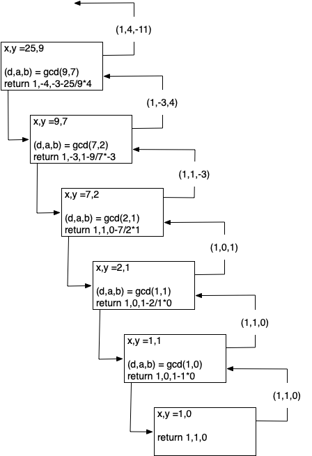

# 8.3. 递归再探

**8.3. Recursion Revisited**

=== "中文"

    One of the most common uses of numerical computing today is in the field of cryptography. Each time you check your bank account, sign on to a secure website to purchase something, or sign on to your computer, you are using cryptography. In a general sense, *cryptography* is concerned with encrypting and decrypting information that you do not want other people to see. In this section we will look at some functions that are used in everyday cryptographic programming. In practice there may be faster ways to implement these functions, but each of them has an interesting recursive implementation.
    
    The algorithms in this section make use of Python’s modulo operator (%). Remember that $a \% b$` is what is left over after $a$ is divided by $b$, for example $10 \% 7 = 3$. When we compute the result of any mathematical expression modulo 10, the only possible results are 0–9.
    
    One of the earliest forms of cryptography used only simple modular arithmetic. Take the string ``"uryybjbeyq"``, for example. Can you guess what message is encrypted? `Listing lst_enc` shows you the function that produced the message. Look at the listing and see if you can figure it out.
    
    ```python title="Listing lst_enc"
    def encrypt(m):
        s = "abcdefghijklmnopqrstuvwxyz"
        n = ""
        for i in m:
            j = (s.find(i) + 13) % 26
            n = n + s[j]
        return n
    ```
    
    The ``encrypt`` function illustrates a form of encryption known as the Caesar Cipher. It also goes by the name ROT13, which is a bit more descriptive. ``encrypt`` simply takes each letter in the message and adds 13 to its ordinal position in the alphabet. If the position goes past the end of the alphabet, it wraps around. This wraparound function is easily accomplished using the modulo operator. In addition, since there are 26 letters in the alphabet, this function is symmetric. The symmetry allows us to use the function to encrypt and decrypt the same message. If you pass the string ``"uryybjbeyg"`` to the ``encrypt`` function, it returns ``"helloworld"``.
    
    Rotations by amounts other than 13 are possible; however, they are not symmetric with respect to encrypting and decrypting. Asymmetry would require us to write a separate decryption algorithm that subtracts the amount to rotate. In that case, we could generalize both the ``encrypt`` and ``decrypt`` functions to take the amount of rotation as a parameter. In cryptographic terms, the rotation parameter is called the *key* and would be the number of positions to rotate. Given the message and the key, the encryption and decryption algorithms can do their jobs. `Listing lst_dec_key` shows the decryption algorithm that takes the amount of rotation as a parameter. As an exercise you should be able to modify `Listing lst_enc` to accept a parameter that specifies a key.
    
    ```python title="Listing lst_dec_key"
       def decrypt(m, k):
           s = "abcdefghijklmnopqrstuvwxyz"
           n = ""
           for i in m:
               j = (s.find(i) + 26 - k) % 26
               n = n + s[j]
           return n
    ```
    
    Even if you keep the number ``k`` from everyone except the person you are sending the message to, this simple form of encryption is not going to stop anyone from stealing your secrets for very long. In the remainder of this section, we will build up to a much more secure form of encryption, the RSA **public key encryption** algorithm.

=== "英文"

    One of the most common uses of numerical computing today is in the field of cryptography. Each time you check your bank account, sign on to a secure website to purchase something, or sign on to your computer, you are using cryptography. In a general sense, *cryptography* is concerned with encrypting and decrypting information that you do not want other people to see. In this section we will look at some functions that are used in everyday cryptographic programming. In practice there may be faster ways to implement these functions, but each of them has an interesting recursive implementation.
    
    The algorithms in this section make use of Python’s modulo operator (%). Remember that $a \% b$` is what is left over after $a$ is divided by $b$, for example $10 \% 7 = 3$. When we compute the result of any mathematical expression modulo 10, the only possible results are 0–9.
    
    One of the earliest forms of cryptography used only simple modular arithmetic. Take the string ``"uryybjbeyq"``, for example. Can you guess what message is encrypted? `Listing lst_enc` shows you the function that produced the message. Look at the listing and see if you can figure it out.
    
    ```python title="Listing lst_enc"
    def encrypt(m):
        s = "abcdefghijklmnopqrstuvwxyz"
        n = ""
        for i in m:
            j = (s.find(i) + 13) % 26
            n = n + s[j]
        return n
    ```
    
    The ``encrypt`` function illustrates a form of encryption known as the Caesar Cipher. It also goes by the name ROT13, which is a bit more descriptive. ``encrypt`` simply takes each letter in the message and adds 13 to its ordinal position in the alphabet. If the position goes past the end of the alphabet, it wraps around. This wraparound function is easily accomplished using the modulo operator. In addition, since there are 26 letters in the alphabet, this function is symmetric. The symmetry allows us to use the function to encrypt and decrypt the same message. If you pass the string ``"uryybjbeyg"`` to the ``encrypt`` function, it returns ``"helloworld"``.
    
    Rotations by amounts other than 13 are possible; however, they are not symmetric with respect to encrypting and decrypting. Asymmetry would require us to write a separate decryption algorithm that subtracts the amount to rotate. In that case, we could generalize both the ``encrypt`` and ``decrypt`` functions to take the amount of rotation as a parameter. In cryptographic terms, the rotation parameter is called the *key* and would be the number of positions to rotate. Given the message and the key, the encryption and decryption algorithms can do their jobs. `Listing lst_dec_key` shows the decryption algorithm that takes the amount of rotation as a parameter. As an exercise you should be able to modify `Listing lst_enc` to accept a parameter that specifies a key.
    
    ```python title="Listing lst_dec_key"
       def decrypt(m, k):
           s = "abcdefghijklmnopqrstuvwxyz"
           n = ""
           for i in m:
               j = (s.find(i) + 26 - k) % 26
               n = n + s[j]
           return n
    ```
    
    Even if you keep the number ``k`` from everyone except the person you are sending the message to, this simple form of encryption is not going to stop anyone from stealing your secrets for very long. In the remainder of this section, we will build up to a much more secure form of encryption, the RSA **public key encryption** algorithm.

## 8.3.1. 模运算定理

**8.3.1. Modular Arithmetic Theorems**

=== "中文"
    
    If two numbers, $a$ and $b$, give the same remainder when divided by $n$, we say that $a$ and $b$ are “congruent modulo $n$.” In shorthand we write $a \equiv~b~\pmod{n}$. The algorithms in this section make use of three important theorems:
    
    1. If $a \equiv b \pmod{n}$ then $\forall c, a + c \equiv b + c \pmod{n}$.
    2. If $a \equiv b \pmod{n}$ then $\forall c, ac \equiv bc \pmod{n}$.
    3. If $a \equiv b \pmod{n}$ then $\forall p, p > 0, a^p \equiv b^p \pmod{n}$.

=== "英文"
    
    If two numbers, $a$ and $b$, give the same remainder when divided by $n$, we say that $a$ and $b$ are “congruent modulo $n$.” In shorthand we write $a \equiv~b~\pmod{n}$. The algorithms in this section make use of three important theorems:
    
    1. If $a \equiv b \pmod{n}$ then $\forall c, a + c \equiv b + c \pmod{n}$.
    2. If $a \equiv b \pmod{n}$ then $\forall c, ac \equiv bc \pmod{n}$.
    3. If $a \equiv b \pmod{n}$ then $\forall p, p > 0, a^p \equiv b^p \pmod{n}$.

## 8.3.2. 模幂运算

**8.3.2. Modular Exponentiation**

=== "中文"

    Suppose we wanted to know the last digit of $3^{1,254,906}$. Not only is that a large computation problem, but using Python’s arbitrary-precision integers the number has 598,743 digits! All we want to know is the value of the rightmost digit. There are really two problems here. First, how do we compute $x^n$ efficiently? Second, how can we compute $x^n \pmod{p}$ without first calculating all 598,743 digits and then looking at the last one?
    
    The answer to the second question is easy, given the third theorem from above.
    
    1. Initialize result to 1.
    2. Repeat $n$ times:
    
       1. Multiply result by $x$.
       2. Apply modulo operation to result.
    
    The above approach makes the computation simpler because we are keeping the result smaller rather than following it out to its full precision. However, we can do even better using a recursive approach.
    
    $x^n = \begin{cases} (x \cdot x)^{ n/2 } & \text{if} \space  n \space  \text{is even} \\ (x \cdot x^{n-1}) = x \cdot (x \cdot x)^{\lfloor n/2 \rfloor} & \text{if} \space  n \space  \text{is odd} \end{cases} \label{eqn:pow}$
    
    Remember that for a floating point number $n$ the floor operation, $\lfloor n \rfloor$, results in the largest integer smaller than $n$. Python’s integer division operator returns the floor of the result of the division, so we do not need to do anything special in our code to achieve the results we want. The above equation gives us a very nice recursive definition for computing $x^n$. All we need now is a base case. Recall that for any number $x$, $x^0 = 1$. Since we are reducing the size of our exponent in each recursive call, checking for the condition $n = 0$ is a good base case.
    
    ```python title="Listing lst_pow"
       def modexp(x, n, p):
           if n == 0:
               return 1
           t = (x * x) % p
           tmp = modexp(t, n // 2, p)
           if n % 2 != 0:
               tmp = (tmp * x) % p
           return tmp
    ```
    
    Notice that in the above equation both the even and odd cases include a factor of $(x \cdot x)^{\lfloor n/2 \rfloor}$, so we compute that unconditionally and store it in the variable ``tmp``. Also note that since we are computing modulo ``p`` we still apply the modulo operator at each step of the calculation. The solution in `Listing lst_pow` keeps the result size small and uses many fewer multiplications than a purely iterative approach.

=== "英文"

    Suppose we wanted to know the last digit of $3^{1,254,906}$. Not only is that a large computation problem, but using Python’s arbitrary-precision integers the number has 598,743 digits! All we want to know is the value of the rightmost digit. There are really two problems here. First, how do we compute $x^n$ efficiently? Second, how can we compute $x^n \pmod{p}$ without first calculating all 598,743 digits and then looking at the last one?
    
    The answer to the second question is easy, given the third theorem from above.
    
    1. Initialize result to 1.
    2. Repeat $n$ times:
    
       1. Multiply result by $x$.
       2. Apply modulo operation to result.
    
    The above approach makes the computation simpler because we are keeping the result smaller rather than following it out to its full precision. However, we can do even better using a recursive approach.
    
    $x^n = \begin{cases} (x \cdot x)^{ n/2 } & \text{if} \space  n \space  \text{is even} \\ (x \cdot x^{n-1}) = x \cdot (x \cdot x)^{\lfloor n/2 \rfloor} & \text{if} \space  n \space  \text{is odd} \end{cases} \label{eqn:pow}$
    
    Remember that for a floating point number $n$ the floor operation, $\lfloor n \rfloor$, results in the largest integer smaller than $n$. Python’s integer division operator returns the floor of the result of the division, so we do not need to do anything special in our code to achieve the results we want. The above equation gives us a very nice recursive definition for computing $x^n$. All we need now is a base case. Recall that for any number $x$, $x^0 = 1$. Since we are reducing the size of our exponent in each recursive call, checking for the condition $n = 0$ is a good base case.
    
    ```python title="Listing lst_pow"
       def modexp(x, n, p):
           if n == 0:
               return 1
           t = (x * x) % p
           tmp = modexp(t, n // 2, p)
           if n % 2 != 0:
               tmp = (tmp * x) % p
           return tmp
    ```
    
    Notice that in the above equation both the even and odd cases include a factor of $(x \cdot x)^{\lfloor n/2 \rfloor}$, so we compute that unconditionally and store it in the variable ``tmp``. Also note that since we are computing modulo ``p`` we still apply the modulo operator at each step of the calculation. The solution in `Listing lst_pow` keeps the result size small and uses many fewer multiplications than a purely iterative approach.

## 8.3.3. 最大公约数与乘法逆元

**8.3.3. The Greatest Common Divisor and Multiplicative Inverses**

=== "中文"
    
    A *multiplicative inverse* of a positive integer $x$ modulo $m$ is any number $a$ such that $ax \equiv 1 \pmod{m}$. For example, let $x = 3$, $m = 7$, and $a = 5$; $3 \times 5 = 15$ and $15\ \%\ 7 = 1$, so 5 is a multiplicative inverse of 3 modulo 7.
    
    The idea of multiplicative inverses in the world of modulo arithmetic may seem very confusing at first. How did we select 5 in the previous example? Is 5 the only multiplicative inverse of 3 modulo 7? Do all numbers $a$ have a multiplicative inverse for any given $m$?
    
    Let’s look at an example that may shed some light on the first question: how did we select 5 as the multiplicative inverse of 3 modulo 7? Look at the following Python session:
    
    ```pycon
    >>> for i in range(1, 40):
    ...    if (3 * i) % 7 == 1:
    ...        print i
    ...
    5
    12
    19
    26
    33
    ```
    
    This little experiment tells us that there are many multiplicative inverses (modulo 7) for $x=3$ and $m = 7$, namely $5, 12, 19, 26, 33$, and so on. Do you notice anything interesting about the sequence? Each number in the sequence is two less than a multiple of seven.
    
    Do all pairs of numbers $x$ and $m$ have a multiplicative inverse? Let’s look at another example. Consider $x=4$ and $m=8$. Plugging 4 and 8 into the loop in the previous example gives us no output. If we take out the conditional and print out the results of $(4 \cdot i)\ \%\ 8$, we get the sequence $(0, 4, 0, 4, 0, 4\dots)$. Here we have a case where the remainder alternates between 0 and 4 repeatedly. Clearly the result is never going to be 1. How can we know that ahead of time?
    
    The answer is that a number $x$ has a multiplicative inverse, modulo $m$, if and only if $m$ and $x$ are relatively prime. Two numbers are relatively prime if $gcd(m,x) = 1$. Recall that the greatest common divisor (GCD) is the largest integer that divides both numbers. The next question is how can we compute the greatest common divisor for a pair of numbers?
    
    Given two numbers $a$ and $b$ we can find the GCD by repeatedly subtracting $b$ from $a$ until $a < b$. When $a < b$, we switch roles for $a$ and $b$. At some point $a - b$ becomes 0, so we swap $a$ and $b$ one more time. At that point we have $gcd(a, 0) = a`. This algorithm was first described more than 2,000 years ago and is called Euclid’s algorithm.
    
    In terms of recursive algorithm design, Euclid’s algorithm is very straightforward. The base case is when $b = 0$. There are two possibilities for a recursive call: when $a < b$, we swap $a$ and $b$ and make a recursive call. Otherwise, we can make a recursive call passing $a - b$ in place of $a$. Euclid’s algorithm is shown in `Listing lst_gcd1`.
    
    ```python title="Listing lst_gcd1"
    def gcd(a, b):
        if b == 0:
            return a
        elif a < b:
            return gcd(b, a)
        return gcd(a - b, b)
    ```
    
    Although Euclid’s algorithm is quite easy to understand and program, it is not as efficient as we would like, particularly if $a >> b$. Once again, modular arithmetic comes to our rescue. Notice that the result of the last subtraction (when $a - b < b$) is really the same as the remainder of $a` divided by $b$. With that in mind, we can cut out all of the subtractions and combine the swap of $a$ and $b$ in one recursive call. A revised algorithm is shown in `Listing lst_gcd2`.
    
    ```python title="Listing lst_gcd2"
       def gcd(a, b):
           if b == 0:
               return a
           return gcd(b, a % b)
    ```
    
    Now that we have a way to know whether two numbers $x$ and $m$ will have a multiplicative inverse, our next task is to write an efficient algorithm to compute the inverse. Suppose that for any pair of numbers $x$ and $y$ we could compute both $gcd(x,y)$ and a pair of integers $a$ and $b$ such that $d = gcd(x, y) = ax + by$. For example, $1 = gcd(3, 7) = -2 \times 3 + 1 \times 7$, so here $a = -2$ and $b = 1$ are possible values for $a$ and $b$. Rather than any numbers $x$ and $y$, let’s use $m$ and $x$ from our previous examples. Now we have $1 = gcd(m, x) = am + bx$. From the discussion at the beginning of this section we know that $bx = 1 \mod{m}$, so $b$ is a multiplicative inverse of $x$ modulo $m$.
    
    We have reduced the problem of computing inverses to the problem of finding integers $a$ and $b$ that satisfy the equation $d = gcd(x, y) = ax + by$. Since we started this problem with the GCD algorithm, we can finish it with an extension of this algorithm as well. We will take two numbers $x >= y$ and return a tuple $(d, a, b)$ such that $d = gcd(x, y)$ and $d = ax + by$. The extension to Euclid’s algorithm is shown in `Listing lst_gcd3`.
    
    ```python title="Listing lst_gcd3" linenums="1"
       def ext_gcd(x, y):
           if y == 0:
               return (x, 1, 0)
           else:
               (d, a, b) = ext_gcd(y, x % y)
               return (d, b, a - (x // y) * b)
    ```
    
    Notice that when we get the base case $y = 0$, we return $d = x$ just like the original Euclid’s algorithm. However, we return two additional values $a =1$ and $b = 0$. Together these three values satisfy the equation $d = ax + by$. If $y > 0$, then we recursively compute values $(d, a, b)$ such that $d = gcd(y, x \mod{y})$ and $d = ay + b(x \mod{y})$. As with the original algorithm, $d = gcd(x, y)$. But what about the other two values, $a$ and $b$? We know that $a$ and $b$ must be integers, so let’s call them $A$ and $B$. Further, we know that $d = Ax + By$. To figure out what $A$ and $B$ should be, let’s rearrange the equation as follows:
    
    $\begin{aligned} d = & ay + b(x \mod{y}) \\   = & ay + b(x - \lfloor x / y \rfloor y) \\   = & bx + (a - \lfloor x / y \rfloor b)y\end{aligned}$
    
    Note the substitution made in the second line, $x \mod{y} = x - \lfloor x / y \rfloor$. This is legal because this is how we would normally calculate the remainder of x / y ($x \mod{y}$). Looking at the rearranged equation, we can see that $A = b$ and $B = a - \lfloor x / y \rfloor b$. Notice that this is exactly what line `[line:6]` does! To check this, note that at each return step in the algorithm the return values satisfy the equation $d = ax + by$. To understand how our extended GCD algorithm works, let’s start with an example: let $x = 25$ and $y = 9$. `Figure 1` illustrates the call and return values for the recursive function.
    
    <figure markdown="span">
        
        <figcaption markdown="span">Figure 1: FiguCall Tree for Extended GCD Algorithm</figcaption>
    </figure>

=== "英文"
    
    A *multiplicative inverse* of a positive integer $x$ modulo $m$ is any number $a$ such that $ax \equiv 1 \pmod{m}$. For example, let $x = 3$, $m = 7$, and $a = 5$; $3 \times 5 = 15$ and $15\ \%\ 7 = 1$, so 5 is a multiplicative inverse of 3 modulo 7.
    
    The idea of multiplicative inverses in the world of modulo arithmetic may seem very confusing at first. How did we select 5 in the previous example? Is 5 the only multiplicative inverse of 3 modulo 7? Do all numbers $a$ have a multiplicative inverse for any given $m$?
    
    Let’s look at an example that may shed some light on the first question: how did we select 5 as the multiplicative inverse of 3 modulo 7? Look at the following Python session:
    
    ```pycon
    >>> for i in range(1, 40):
    ...    if (3 * i) % 7 == 1:
    ...        print i
    ...
    5
    12
    19
    26
    33
    ```
    
    This little experiment tells us that there are many multiplicative inverses (modulo 7) for $x=3$ and $m = 7$, namely $5, 12, 19, 26, 33$, and so on. Do you notice anything interesting about the sequence? Each number in the sequence is two less than a multiple of seven.
    
    Do all pairs of numbers $x$ and $m$ have a multiplicative inverse? Let’s look at another example. Consider $x=4$ and $m=8$. Plugging 4 and 8 into the loop in the previous example gives us no output. If we take out the conditional and print out the results of $(4 \cdot i)\ \%\ 8$, we get the sequence $(0, 4, 0, 4, 0, 4\dots)$. Here we have a case where the remainder alternates between 0 and 4 repeatedly. Clearly the result is never going to be 1. How can we know that ahead of time?
    
    The answer is that a number $x$ has a multiplicative inverse, modulo $m$, if and only if $m$ and $x$ are relatively prime. Two numbers are relatively prime if $gcd(m,x) = 1$. Recall that the greatest common divisor (GCD) is the largest integer that divides both numbers. The next question is how can we compute the greatest common divisor for a pair of numbers?
    
    Given two numbers $a$ and $b$ we can find the GCD by repeatedly subtracting $b$ from $a$ until $a < b$. When $a < b$, we switch roles for $a$ and $b$. At some point $a - b$ becomes 0, so we swap $a$ and $b$ one more time. At that point we have $gcd(a, 0) = a`. This algorithm was first described more than 2,000 years ago and is called Euclid’s algorithm.
    
    In terms of recursive algorithm design, Euclid’s algorithm is very straightforward. The base case is when $b = 0$. There are two possibilities for a recursive call: when $a < b$, we swap $a$ and $b$ and make a recursive call. Otherwise, we can make a recursive call passing $a - b$ in place of $a$. Euclid’s algorithm is shown in `Listing lst_gcd1`.
    
    ```python title="Listing lst_gcd1"
    def gcd(a, b):
        if b == 0:
            return a
        elif a < b:
            return gcd(b, a)
        return gcd(a - b, b)
    ```
    
    Although Euclid’s algorithm is quite easy to understand and program, it is not as efficient as we would like, particularly if $a >> b$. Once again, modular arithmetic comes to our rescue. Notice that the result of the last subtraction (when $a - b < b$) is really the same as the remainder of $a` divided by $b$. With that in mind, we can cut out all of the subtractions and combine the swap of $a$ and $b$ in one recursive call. A revised algorithm is shown in `Listing lst_gcd2`.
    
    ```python title="Listing lst_gcd2"
       def gcd(a, b):
           if b == 0:
               return a
           return gcd(b, a % b)
    ```
    
    Now that we have a way to know whether two numbers $x$ and $m$ will have a multiplicative inverse, our next task is to write an efficient algorithm to compute the inverse. Suppose that for any pair of numbers $x$ and $y$ we could compute both $gcd(x,y)$ and a pair of integers $a$ and $b$ such that $d = gcd(x, y) = ax + by$. For example, $1 = gcd(3, 7) = -2 \times 3 + 1 \times 7$, so here $a = -2$ and $b = 1$ are possible values for $a$ and $b$. Rather than any numbers $x$ and $y$, let’s use $m$ and $x$ from our previous examples. Now we have $1 = gcd(m, x) = am + bx$. From the discussion at the beginning of this section we know that $bx = 1 \mod{m}$, so $b$ is a multiplicative inverse of $x$ modulo $m$.
    
    We have reduced the problem of computing inverses to the problem of finding integers $a$ and $b$ that satisfy the equation $d = gcd(x, y) = ax + by$. Since we started this problem with the GCD algorithm, we can finish it with an extension of this algorithm as well. We will take two numbers $x >= y$ and return a tuple $(d, a, b)$ such that $d = gcd(x, y)$ and $d = ax + by$. The extension to Euclid’s algorithm is shown in `Listing lst_gcd3`.
    
    ```python title="Listing lst_gcd3" linenums="1"
       def ext_gcd(x, y):
           if y == 0:
               return (x, 1, 0)
           else:
               (d, a, b) = ext_gcd(y, x % y)
               return (d, b, a - (x // y) * b)
    ```
    
    Notice that when we get the base case $y = 0$, we return $d = x$ just like the original Euclid’s algorithm. However, we return two additional values $a =1$ and $b = 0$. Together these three values satisfy the equation $d = ax + by$. If $y > 0$, then we recursively compute values $(d, a, b)$ such that $d = gcd(y, x \mod{y})$ and $d = ay + b(x \mod{y})$. As with the original algorithm, $d = gcd(x, y)$. But what about the other two values, $a$ and $b$? We know that $a$ and $b$ must be integers, so let’s call them $A$ and $B$. Further, we know that $d = Ax + By$. To figure out what $A$ and $B$ should be, let’s rearrange the equation as follows:
    
    $\begin{aligned} d = & ay + b(x \mod{y}) \\   = & ay + b(x - \lfloor x / y \rfloor y) \\   = & bx + (a - \lfloor x / y \rfloor b)y\end{aligned}$
    
    Note the substitution made in the second line, $x \mod{y} = x - \lfloor x / y \rfloor$. This is legal because this is how we would normally calculate the remainder of x / y ($x \mod{y}$). Looking at the rearranged equation, we can see that $A = b$ and $B = a - \lfloor x / y \rfloor b$. Notice that this is exactly what line `[line:6]` does! To check this, note that at each return step in the algorithm the return values satisfy the equation $d = ax + by$. To understand how our extended GCD algorithm works, let’s start with an example: let $x = 25$ and $y = 9$. `Figure 1` illustrates the call and return values for the recursive function.
    
    <figure markdown="span">
        
        <figcaption markdown="span">Figure 1: FiguCall Tree for Extended GCD Algorithm</figcaption>
    </figure>


## 8.3.4. RSA算法

**8.3.4. RSA Algorithm**

=== "中文"

    Now we have all the tools we need to write the RSA encryption algorithm. The **RSA algorithm** is perhaps the easiest to understand of all the public key encryption algorithms. Public key cryptography was invented by Whitfield Diffie and Martin Hellman and independently by Ralph Merkle. The major contribution of public key cryptography was the idea that keys could come in pairs: an encryption key to convert the plaintext message to ciphertext, and a decryption key to convert the ciphertext back to plaintext. The keys only work one way so that a message encrypted with the private key can only be decrypted with the public key, and vice versa.
    
    RSA gets its security from the difficulty of factoring large numbers. The public and private keys are derived from a pair of large (100–200 digit) prime numbers. Since long integers are native to Python, this is a fun and easy algorithm to implement.
    
    To generate the two keys, choose two large prime numbers $p$ and $q$. Then compute the product
    
    $n = p \times q$
    
    The next step is to randomly choose the encryption key $e$ such that $e$ and $(p - 1) \times (q - 1)$ are relatively prime; that is
    
    $gcd(e, (p - 1) \times (q-1)) = 1$
    
    Finally, the decryption key $d$ is simply the multiplicative inverse of $e$ modulo $(p - 1) \times (q - 1)$. For this we can use our extended version of Euclid’s algorithm.
    
    The numbers $e$ and $n$ taken together are the public key. The number $d$ is the private key. Once we have computed $n, e$, and $d$, the original primes $p$ and $q$ are no longer needed. However, they should not be revealed.
    
    To encrypt a message we simply use the equation $c = m^e \pmod{n}$. To decrypt the message we use $m = c^d \pmod{n}$.
    
    It is easy to see that this works when you remember that $d$ is the multiplicative inverse of $e \pmod{n}$.
    
    $\begin{aligned}   c^d & = (m^e)^d  \pmod{n} \\       & = m^{ed}   \pmod{n} \\       & = m^1  \pmod{n} \\       & = m \pmod{n} \end{aligned}$
    
    Before we turn all these equations into Python code, we need to talk about a couple of other details. First, how do we take a text message like "hello world" and turn it into a number? The easiest way is to simply use the ASCII values associated with each character and concatenate all the numbers together. However, since the decimal versions of the numbers of the ASCII values vary in the number of digits needed to represent them, we will use the hexadecimal numbers where we know very reliably that two hexadecimal digits represent a single byte or character.
    
    | h   | e   | l   | l   | o   |     | w   | o   | r   | l   | d   |
    | --- | --- | --- | --- | --- | --- | --- | --- | --- | --- | --- |
    | 104 | 101 | 108 | 108 | 111 | 32  | 119 | 111 | 114 | 108 | 100 |
    | 68  | 65  | 6c  | 6c  | 6f  | 20  | 77  | 6f  | 72  | 6c  | 64  |
    
    
    Putting all the hexadecimal digits together we could convert that large hex number into a decimal integer:
    
    $m = 126207244316550804821666916$
    
    Python can handle this large number just fine. However, there are two reasons that real programs using RSA encryption break the message up into smaller chunks and encrypt each chunk. The first reason is performance. Even a relatively short email message, say 1k of text, will generate a number with 2,000 to 3,000 digits! If we raise that to a power of $d$ which has 10 digits, we are talking about a very long number indeed.
    
    The second reason for breaking the message into chunks is the restriction that $m \le n$. We must be sure that the message has a unique representation modulo $n$. With binary data, choose the largest power of two that is less than $n$. For example, let’s choose $p$ and $q$ to be 5563 and 8191. So $n = 5563 \times 8191 = 45,566,533$. To keep the integer value of our chunks less than $m$, we will divide up our word into chunks that use less than the number of bytes needed to represent $n$. This is easy to find in Python using the integer method ``bit_length``. Given the number of bits needed to represent a number, we can divide by eight to find the number of bytes. Since each character in the message can be represented by a single byte, this division tells us the number of bytes we can put in each chunk. Conveniently, this lets us simply break the message up into chunks of $n$ characters and convert the hexadecimal representation of each chunk into an integer. For this example we can represent $45,566,533$ using 26 bits. Using integer division and dividing by eight tells us that we should break our message into chunks of three characters.
    
    The characters “h,” “e,” and “l” have the hexadecimal values of $68$, $65$, and $6c$, respectively. Concatenating those together gives us $68656c$ and converting that to a decimal gives us $6841708$.
    
    | -               | -               | -               | -             |
    | --------------- | --------------- | --------------- | ------------- |
    | $m_1 = 6841708$ | $m_2 = 7106336$ | $m_3 = 7827314$ | $m_4 = 27748$ |
    
    
    Note that breaking the message into chunks can be very tricky, in particular when the result of applying the RSA transformation to a chunk produces a number that is less than seven digits long. In this case we need to be careful to add a leading zero to the result when we glue our chunks back together again. You can see how this might happen in $m_1$ and $m_4$ above.
    
    Now let’s choose a value for $e$. We can select values randomly and use the GCD algorithm to test them against $(p - 1) \times (q - 1) = 45552780$. Remember that we are looking for an $e$ that is relatively prime to 45,552,780. The number 1,471 will work nicely for this example.
    
    $\begin{aligned}d & = ext\_gcd(45552780, 1471) \\    & = -11705609  \\    & = 45552780-11705609  \\    & = 33847171\end{aligned}$
    
    Let’s use this information to encrypt the first chunk of our message:
    
    $c = 6841708^{1471} \pmod{45566533} = 16310024$
    
    To check our work, let’s decrypt $c$ to make sure we recover the original value:
    
    $m = 16310024^{33847171} \pmod{45566533} = 6841708$
    
    The remaining chunks of the message can be encrypted using the same procedure and sent all together as the encrypted message.
    
    Finally, let’s look at three Python functions.
    
    - ``gen_keys`` creates a public and private key, given $p$ and $q$.
    - ``encrypt`` takes a message, the public key, and $n$ and returns  an encrypted version of the message.
    - ``decrypt`` takes the encrypted message, the private key, and $n$ and 
      returns the original message.
    
    ```python
    def gen_keys(p, q):
        n = p * q
        m = (p - 1) * (q - 1)
        e = int(random.random() * n)
        while gcd(m, e) != 1:
            e = int(random.random() * n)
        d, a, b = ext_gcd(m, e)
        if b < 0:
            d = m + b
        else:
            d = b
        return (e, d, n)
    
    def encrypt(msg, e, n):
        chunk_size = n.bit_length() // 8
        all_chunks = str_to_chunks(msg, chunk_size)
        return [
            modexp(msg_chunk, e, n)
            for msg_chunk in all_chunks
        ]
    
    def decrypt(cipher_chunks, d, n):
        chunk_size = n.bit_length() // 8
        plain_chunks = [
            modexp(cipher_chunk, d, n)
            for cipher_chunk in cipher_chunks
        ]
        return chunks_to_str(plain_chunks, chunk_size)
    ```
    
    Here is a session that uses these functions to create public and private keys, encrypt, and decrypt as we did in the example above.
    
    ```pycon
    >>> msg = "Python"
    >>> e, d, n = gen_keys(5563, 8191)
    >>> print(e, d, n)
    2646697 33043453 45566533
    >>> c = encrypt(msg, e, n)
    >>> print(c)
    [22810070, 18852325, 34390906, 22805081]
    >>> m = decrypt(c, d, n)
    >>> print(m)
    Python
    >>>
    ```
    
    The last thing to look at is the two helper functions that break our string into chunks and merge chunks into a string (`Listing lst_chunk`). These functions make use of Python ``bytearray`` objects, which allow us to store any string as a sequence of bytes.  This makes it very convenient for us to convert a string to a sequence of hexadecimal digits and allows us to convert a sequence of hexadecimal digits back to a string.
    
    ```python title="Listing lst_chunk"
    def str_to_chunks(msg, chunk_size):
        msg_bytes = bytes(msg, "utf-8")
        hex_str = "".join([f"{b:02x}" for b in msg_bytes])
        num_chunks = len(hex_str) // chunk_size
        chunk_list = []
        for i in range(
            0, num_chunks * chunk_size + 1, chunk_size
        ):
            chunk_list.append(hex_str[i : i + chunk_size])
        chunk_list = [
            eval("0x" + x) for x in chunk_list if x
        ]
        return chunk_list
    
    
    def chunks_to_str(chunk_list, chunk_size):
        hex_list = []
        for chunk in chunk_list:
            hex_str = hex(chunk)[2:]
            clen = len(hex_str)
            hex_list.append(
                "0" * ((chunk_size - clen) % 2) + hex_str
            )
    
        hstring = "".join(hex_list)
        msg_array = bytearray.fromhex(hstring)
        return msg_array.decode("utf-8")
    ```
    
    In `Listing lst_chunk` we see the procedure for turning a string into a list of chunks. One important thing to note is that we must always make sure that our hexadecimal number corresponds to a character that is exactly two digits long. This means that sometimes we may need to add a leading zero. We can do this easily by using the string formatting expression ``f"{b:02x}"``. This expression creates a string that is exactly two characters long, with a leading zero at the beginning if necessary. Once we have created a single long hexadecimal string out of the entire message, we can then break up that long string into ``num_chunks`` chunks of hexadecimal numbers. This is what is happening in the ``for`` loop (starting on line 6). Finally, we can transform each hexadecimal number into an integer using the ``eval`` function and the list comprehension.
    
    Transforming the decrypted chunks back to a string is as easy as creating a single long hex string and turning that hexadecimal string into a ``bytearray``. The ``bytearray`` has a built-in ``decode`` function to turn the ``bytearray`` into a string. The only tricky part of this procedure is that after the transformation process the number represented by the chunk may end up significantly smaller than the original. If this is the case we may need to add a leading zero to make sure that all of the chunks are the same length when we concatenate them back together again. The extra zeros are prepended to any chunk by using the string repetition operator in the expression ``"0" * ((chunk_size) - clen) % 2)`` where ``chunk_size`` represents the number of digits that should be present in the string and ``clen`` represents the actual number.

=== "英文"

    Now we have all the tools we need to write the RSA encryption algorithm. The **RSA algorithm** is perhaps the easiest to understand of all the public key encryption algorithms. Public key cryptography was invented by Whitfield Diffie and Martin Hellman and independently by Ralph Merkle. The major contribution of public key cryptography was the idea that keys could come in pairs: an encryption key to convert the plaintext message to ciphertext, and a decryption key to convert the ciphertext back to plaintext. The keys only work one way so that a message encrypted with the private key can only be decrypted with the public key, and vice versa.
    
    RSA gets its security from the difficulty of factoring large numbers. The public and private keys are derived from a pair of large (100–200 digit) prime numbers. Since long integers are native to Python, this is a fun and easy algorithm to implement.
    
    To generate the two keys, choose two large prime numbers $p$ and $q$. Then compute the product
    
    $n = p \times q$
    
    The next step is to randomly choose the encryption key $e$ such that $e$ and $(p - 1) \times (q - 1)$ are relatively prime; that is
    
    $gcd(e, (p - 1) \times (q-1)) = 1$
    
    Finally, the decryption key $d$ is simply the multiplicative inverse of $e$ modulo $(p - 1) \times (q - 1)$. For this we can use our extended version of Euclid’s algorithm.
    
    The numbers $e$ and $n$ taken together are the public key. The number $d$ is the private key. Once we have computed $n, e$, and $d$, the original primes $p$ and $q$ are no longer needed. However, they should not be revealed.
    
    To encrypt a message we simply use the equation $c = m^e \pmod{n}$. To decrypt the message we use $m = c^d \pmod{n}$.
    
    It is easy to see that this works when you remember that $d$ is the multiplicative inverse of $e \pmod{n}$.
    
    $\begin{aligned}   c^d & = (m^e)^d  \pmod{n} \\       & = m^{ed}   \pmod{n} \\       & = m^1  \pmod{n} \\       & = m \pmod{n} \end{aligned}$
    
    Before we turn all these equations into Python code, we need to talk about a couple of other details. First, how do we take a text message like "hello world" and turn it into a number? The easiest way is to simply use the ASCII values associated with each character and concatenate all the numbers together. However, since the decimal versions of the numbers of the ASCII values vary in the number of digits needed to represent them, we will use the hexadecimal numbers where we know very reliably that two hexadecimal digits represent a single byte or character.
    
    | h   | e   | l   | l   | o   |     | w   | o   | r   | l   | d   |
    | --- | --- | --- | --- | --- | --- | --- | --- | --- | --- | --- |
    | 104 | 101 | 108 | 108 | 111 | 32  | 119 | 111 | 114 | 108 | 100 |
    | 68  | 65  | 6c  | 6c  | 6f  | 20  | 77  | 6f  | 72  | 6c  | 64  |
    
    
    Putting all the hexadecimal digits together we could convert that large hex number into a decimal integer:
    
    $m = 126207244316550804821666916$
    
    Python can handle this large number just fine. However, there are two reasons that real programs using RSA encryption break the message up into smaller chunks and encrypt each chunk. The first reason is performance. Even a relatively short email message, say 1k of text, will generate a number with 2,000 to 3,000 digits! If we raise that to a power of $d$ which has 10 digits, we are talking about a very long number indeed.
    
    The second reason for breaking the message into chunks is the restriction that $m \le n$. We must be sure that the message has a unique representation modulo $n$. With binary data, choose the largest power of two that is less than $n$. For example, let’s choose $p$ and $q$ to be 5563 and 8191. So $n = 5563 \times 8191 = 45,566,533$. To keep the integer value of our chunks less than $m$, we will divide up our word into chunks that use less than the number of bytes needed to represent $n$. This is easy to find in Python using the integer method ``bit_length``. Given the number of bits needed to represent a number, we can divide by eight to find the number of bytes. Since each character in the message can be represented by a single byte, this division tells us the number of bytes we can put in each chunk. Conveniently, this lets us simply break the message up into chunks of $n$ characters and convert the hexadecimal representation of each chunk into an integer. For this example we can represent $45,566,533$ using 26 bits. Using integer division and dividing by eight tells us that we should break our message into chunks of three characters.
    
    The characters “h,” “e,” and “l” have the hexadecimal values of $68$, $65$, and $6c$, respectively. Concatenating those together gives us $68656c$ and converting that to a decimal gives us $6841708$.
    
    | -               | -               | -               | -             |
    | --------------- | --------------- | --------------- | ------------- |
    | $m_1 = 6841708$ | $m_2 = 7106336$ | $m_3 = 7827314$ | $m_4 = 27748$ |
    
    
    Note that breaking the message into chunks can be very tricky, in particular when the result of applying the RSA transformation to a chunk produces a number that is less than seven digits long. In this case we need to be careful to add a leading zero to the result when we glue our chunks back together again. You can see how this might happen in $m_1$ and $m_4$ above.
    
    Now let’s choose a value for $e$. We can select values randomly and use the GCD algorithm to test them against $(p - 1) \times (q - 1) = 45552780$. Remember that we are looking for an $e$ that is relatively prime to 45,552,780. The number 1,471 will work nicely for this example.
    
    $\begin{aligned}d & = ext\_gcd(45552780, 1471) \\    & = -11705609  \\    & = 45552780-11705609  \\    & = 33847171\end{aligned}$
    
    Let’s use this information to encrypt the first chunk of our message:
    
    $c = 6841708^{1471} \pmod{45566533} = 16310024$
    
    To check our work, let’s decrypt $c$ to make sure we recover the original value:
    
    $m = 16310024^{33847171} \pmod{45566533} = 6841708$
    
    The remaining chunks of the message can be encrypted using the same procedure and sent all together as the encrypted message.
    
    Finally, let’s look at three Python functions.
    
    - ``gen_keys`` creates a public and private key, given $p$ and $q$.
    - ``encrypt`` takes a message, the public key, and $n$ and returns  an encrypted version of the message.
    - ``decrypt`` takes the encrypted message, the private key, and $n$ and 
      returns the original message.
    
    ```python
    def gen_keys(p, q):
        n = p * q
        m = (p - 1) * (q - 1)
        e = int(random.random() * n)
        while gcd(m, e) != 1:
            e = int(random.random() * n)
        d, a, b = ext_gcd(m, e)
        if b < 0:
            d = m + b
        else:
            d = b
        return (e, d, n)
    
    def encrypt(msg, e, n):
        chunk_size = n.bit_length() // 8
        all_chunks = str_to_chunks(msg, chunk_size)
        return [
            modexp(msg_chunk, e, n)
            for msg_chunk in all_chunks
        ]
    
    def decrypt(cipher_chunks, d, n):
        chunk_size = n.bit_length() // 8
        plain_chunks = [
            modexp(cipher_chunk, d, n)
            for cipher_chunk in cipher_chunks
        ]
        return chunks_to_str(plain_chunks, chunk_size)
    ```
    
    Here is a session that uses these functions to create public and private keys, encrypt, and decrypt as we did in the example above.
    
    ```pycon
    >>> msg = "Python"
    >>> e, d, n = gen_keys(5563, 8191)
    >>> print(e, d, n)
    2646697 33043453 45566533
    >>> c = encrypt(msg, e, n)
    >>> print(c)
    [22810070, 18852325, 34390906, 22805081]
    >>> m = decrypt(c, d, n)
    >>> print(m)
    Python
    >>>
    ```
    
    The last thing to look at is the two helper functions that break our string into chunks and merge chunks into a string (`Listing lst_chunk`). These functions make use of Python ``bytearray`` objects, which allow us to store any string as a sequence of bytes.  This makes it very convenient for us to convert a string to a sequence of hexadecimal digits and allows us to convert a sequence of hexadecimal digits back to a string.
    
    ```python title="Listing lst_chunk"
    def str_to_chunks(msg, chunk_size):
        msg_bytes = bytes(msg, "utf-8")
        hex_str = "".join([f"{b:02x}" for b in msg_bytes])
        num_chunks = len(hex_str) // chunk_size
        chunk_list = []
        for i in range(
            0, num_chunks * chunk_size + 1, chunk_size
        ):
            chunk_list.append(hex_str[i : i + chunk_size])
        chunk_list = [
            eval("0x" + x) for x in chunk_list if x
        ]
        return chunk_list
    
    
    def chunks_to_str(chunk_list, chunk_size):
        hex_list = []
        for chunk in chunk_list:
            hex_str = hex(chunk)[2:]
            clen = len(hex_str)
            hex_list.append(
                "0" * ((chunk_size - clen) % 2) + hex_str
            )
    
        hstring = "".join(hex_list)
        msg_array = bytearray.fromhex(hstring)
        return msg_array.decode("utf-8")
    ```
    
    In `Listing lst_chunk` we see the procedure for turning a string into a list of chunks. One important thing to note is that we must always make sure that our hexadecimal number corresponds to a character that is exactly two digits long. This means that sometimes we may need to add a leading zero. We can do this easily by using the string formatting expression ``f"{b:02x}"``. This expression creates a string that is exactly two characters long, with a leading zero at the beginning if necessary. Once we have created a single long hexadecimal string out of the entire message, we can then break up that long string into ``num_chunks`` chunks of hexadecimal numbers. This is what is happening in the ``for`` loop (starting on line 6). Finally, we can transform each hexadecimal number into an integer using the ``eval`` function and the list comprehension.
    
    Transforming the decrypted chunks back to a string is as easy as creating a single long hex string and turning that hexadecimal string into a ``bytearray``. The ``bytearray`` has a built-in ``decode`` function to turn the ``bytearray`` into a string. The only tricky part of this procedure is that after the transformation process the number represented by the chunk may end up significantly smaller than the original. If this is the case we may need to add a leading zero to make sure that all of the chunks are the same length when we concatenate them back together again. The extra zeros are prepended to any chunk by using the string repetition operator in the expression ``"0" * ((chunk_size) - clen) % 2)`` where ``chunk_size`` represents the number of digits that should be present in the string and ``clen`` represents the actual number.