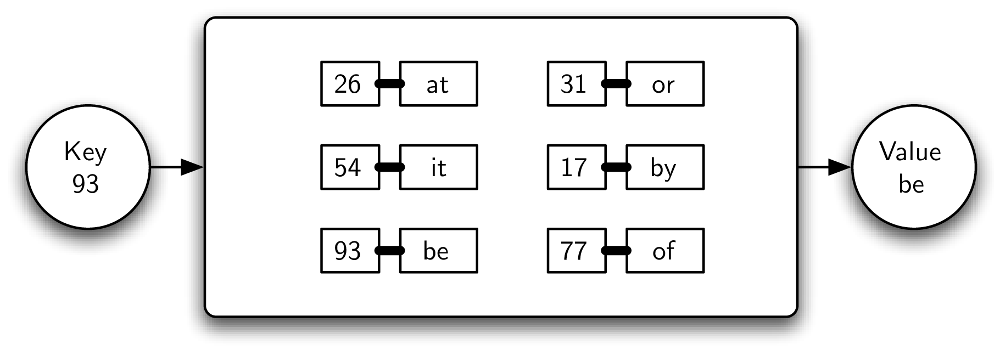
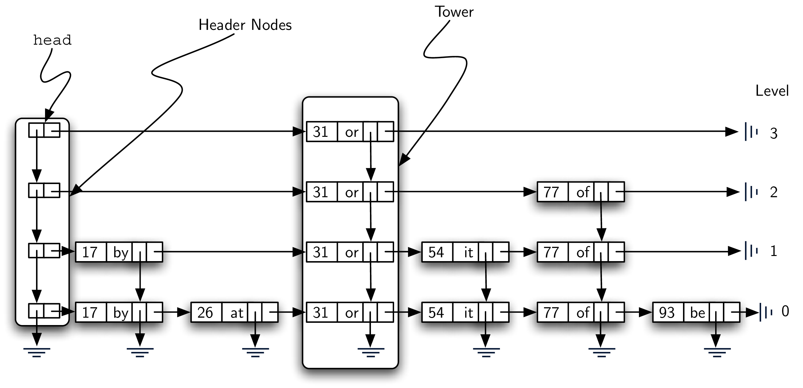

# 8.4. 字典再探：跳表

**8.4. Dictionaries Revisited: Skip Lists**

=== "中文"

    Python 中最通用的集合之一是 **字典**。字典，通常被称为 **映射**，存储一组键值对。键必须是唯一的，并与特定的数据值关联。给定一个键，可以从映射中查找与该键关联的数据值。将键值对放入映射中以及根据给定的键查找数据值是所有映射必须提供的基本操作。
    
    例如，`图 1` 展示了一个包含键值对的映射。在这个例子中，键是整数，值是小的两字符单词。从逻辑上讲，键值对之间没有固有的顺序或组织。然而，如示例所示，如果给出一个键（93），则会返回与之关联的值（be）。
    
    <figure markdown="span">
        
        <figcaption markdown="span">图 1：示例映射</figcaption>
    </figure>

=== "英文"

    One of the most versatile collections available in Python is the **dictionary**. Dictionaries, often referred to as **maps**, store a collection of key-value pairs. The key, which must be unique, is assigned an association with a particular data value. Given a key, it is possible to ask the map for the corresponding associated data value. The abilities to put a key-value pair into the map and then look up a data value associated with a given key are the fundamental operations that all maps must provide.
    
    For example, `Figure 1` shows a map containing key-value pairs. In this case, the keys are integers and the values are small, two-character words. From a logical perspective, there is no inherent order or organization within the pairs themselves. However, as the example shows, if a key (93) is provided to the map, the associated value (be) is returned.
    
    <figure markdown="span">
        
        <figcaption markdown="span">Figure 1: An Example Map</figcaption>
    </figure>   


## 8.4.1. Map抽象数据类型

**8.4.1. The Map Abstract Data Type**

=== "中文"

    映射抽象数据类型的定义如下：映射的结构，如上所述，是一组键值对，其中值可以通过其关联的键进行访问。映射的操作如下：
    
    - ``Map()`` 创建一个新的空映射。它不需要参数，并返回一个空映射。
    - ``put(key, value)`` 向映射中添加一个新的键值对。它需要键和关联的值，并且不返回任何内容。假设该键在映射中尚不存在。
    - ``get(key)`` 在映射中查找指定的键，并返回关联的值。它需要键，并返回一个值。
    
    需要注意的是，还有许多其他可能的操作可以添加到映射抽象数据类型中。我们将在练习中探讨这些操作。

=== "英文"

    The map abstract data type is defined by the following structure and operations. The structure of a map, as described above, is a collection of key-value pairs where values can be accessed via their associated key. The map operations are given below:
    
    -  ``Map()`` creates a new map that is empty. It needs no parameters and returns an empty map.
    -  ``put(key,value)`` adds a new key-value pair to the map. It needs the key and the associated value and returns nothing. Assume the key is not already in the map.
    -  ``get(key)`` searches for the key in the map and returns the associated value. It needs the key and returns a value.
    
    It should be noted that there are a number of other possible operations that we could add to the map abstract data type. We will explore these in the exercises.

## 8.4.2. 用Python实现字典

**8.4.2. Implementing a Dictionary in Python**

=== "中文"

    我们已经看到了一些有趣的实现映射的方式。在第[章排序与搜索](../c5/index.md)中，我们考虑了哈希表作为提供映射行为的一种手段。给定一组键和一个哈希函数，我们可以将键放入一个集合中，这样我们就可以搜索和检索关联的数据值。我们的分析显示，这种技术可以潜在地实现 $O(1)$ 的搜索。然而，由于表大小、冲突和冲突解决策略等问题，性能会下降。
    
    在第[章树](../c6/index.md)中，我们考虑了二叉搜索树作为存储这种集合的一种方式。在这种情况下，键被放置在树中，从而可以在 $O(\log n)$ 的时间内进行搜索。然而，这仅在树是平衡的情况下成立；即左子树和右子树的大小相似。不幸的是，依赖于插入顺序，键可能会偏向右侧或左侧。在这种情况下，搜索效率再次下降。
    
    我们在这里要解决的问题是提出一种实现方法，既具备高效搜索的优点，又不具备上述缺陷。一种这样的可能性是 **跳表**。`图2` 显示了一个可能的跳表，用于展示 `图1` 中的键值对集合（之所以说“可能”，稍后会解释）。如图所示，跳表基本上是一个二维链表，其中所有链接都向前（向右）或向下。链表的 *头部* 可以在左上角看到。请注意，这是进入跳表结构的唯一入口。
    
    <figure markdown="span">
        
        <figcaption markdown="span">图2：跳表示例</figcaption>
    </figure>
    
    在深入了解跳表处理细节之前，先解释一些术语。`图3` 显示了跳表结构的主要部分，由一系列数据节点组成，每个数据节点保存一个键和一个关联值。此外，每个数据节点都有两个引用。`图4` 显示了单个数据节点的详细视图。
    
    <figure markdown="span">
        
        <figcaption markdown="span">图3：跳表的主体由数据节点组成</figcaption>
    </figure>
    
    <figure markdown="span">
        
        <figcaption markdown="span">图4：单个数据节点</figcaption>
    </figure>
    
    `图5` 显示了两个不同的垂直列。最左侧的列由一系列头节点组成。每个头节点保存两个引用，称为 ``down`` 和 ``next``。``next`` 引用指向一个数据节点的链表。``down`` 引用指向下一个较低的头节点。`图6` 显示了头节点的详细视图。
    
    <figure markdown="span">
        
        <figcaption markdown="span">图5：头节点和塔</figcaption>
    </figure>
    
    <figure markdown="span">
        
        <figcaption markdown="span">图6：每个头节点保存两个引用</figcaption>
    </figure>
    
    数据节点的列称为 **塔**。塔通过数据节点中的 ``down`` 引用链接在一起。我们可以看到，每个塔对应于一个特定的键值对，并且塔的高度可能不同。我们将在稍后讨论如何确定塔的高度，以及如何将数据添加到跳表中。
    
    最后，`图7` 显示了节点的水平集合。如果仔细观察，你会发现每个层级实际上是一个有序的链表，链表中的顺序由键维持。每个链表都有一个名称，通常称为 **层级**。层级从0开始，层级0包含所有的节点。每个键值对必须出现在层级0的链表中。然而，当我们向上移动到更高的层级时，我们会看到节点的数量减少。这是跳表的一个重要特性，并将导致高效的搜索。再次可以看到，每个层级的节点数量与塔的高度直接相关。
    
    <figure markdown="span">
        
        <figcaption markdown="span">图7：每个水平组的数据节点就是一个层级</figcaption>
    </figure>
    
    上述两种节点类型的类可以像前一节中简单链表那样轻松构造。头节点由两个引用组成，``next`` 和 ``down``，它们都在构造函数中初始化为 ``None``（见 `Listing lst_headnode`）。
    
    ```python title="Listing lst_headnode"
    class HeaderNode:
        def __init__(self):
            self._next = None
            self._down = None
    
        @property
        def next(self):
            return self._next
    
        @next.setter
        def next(self, value):
            self._next = value
    
        @property
        def down(self):
            return self._down
    
        @down.setter
        def down(self, value):
            self._down = value
    ```
    
    数据节点有四个字段：两个用于键和值，另外两个用于 ``next`` 和 ``down`` 的引用。同样，这些引用初始化为 ``None`` 并封装为 ``properties`` 以进行数据操作（见 `Listing lst_datanode`）。
    
    ```python title="Listing lst_datanode"
    class DataNode:
        def __init__(self, key, value):
            self._key = key
            self._data = value
            self._next = None
            self._down = None
    
        @property
        def key(self):
            return self._key
    
        @property
        def data(self):
            return self._data
    
        @data.setter
        def data(self, value):
            self._data = value
    
        @property
        def next(self):
            return self._next
    
        @next.setter
        def next(self, value):
            self._next = value
    
        @property
        def down(self):
            return self._down
    
        @down.setter
        def down(self, value):
            self._down = value
    ```
    
    跳表的构造函数如 `Listing lst_constructor` 所示。当创建跳表时，没有数据，也没有头节点。跳表的头部设置为 ``None``。随着键值对的添加，列表头引用到第一个头节点，头节点进一步提供对数据节点链表的访问以及对较低层级的访问。
    
    ```python title="Listing lst_constructor"
    class SkipList:
        def __init__(self):
            self._head = None
    ```

=== "英文"

    We have already seen a number of interesting ways to implement the map idea. In Chapter [sorting-and-searching](../c5/index.md) we considered the hash table as a means of providing map behavior. Given a set of keys and a hash function, we could place the keys in a collection that allowed us to search and retrieve the associated data value. Our analysis showed that this technique could potentially yield an $O(1)$ search. However, performance degraded due to issues such as table size, collisions, and collision resolution strategy.
    
    In Chapter [trees](../c6/index.md) we considered a binary search tree as a way to store such a collection. In this case the keys were placed in the tree such that searching could be done in $O(\log n)$. However, this was only true if the tree was balanced; that is, the left and the right subtrees were all of similar size. Unfortunately, depending on the order of insertion, the keys could end up being skewed to the right or to the left. In this case the search again degrades.
    
    The problem we would like to address here is to come up with an implementation that has the advantages of an efficient search without the drawbacks described above. One such possibility is called a **skip list**. `Figure 2` shows a possible skip list for the collection of key-value pairs shown in `Figure 1` (the reason for saying “possible” will become apparent later). As you can see, a skip list is basically a two-dimensional linked list where the links all go forward (to the right) or down. The *head* of the list can be seen in the upper left corner. Note that this is the only entry point into the skip list structure.
        
    <figure markdown="span">
        
        <figcaption markdown="span">Figure 2 An Example Skip List</figcaption>
    </figure>  
    
    Before moving on to the details of skip-list processing it will be useful to explain some vocabulary. `Figure 3` shows that the majority of the skip list structure consists of a collection of data nodes, each of which holds a key and an associated value. In addition, there are two references from each data node. `Figure 4` shows a detailed view of a single data node.
        
    <figure markdown="span">
        
        <figcaption markdown="span">Figure 3: The Body of the Skip List Is Made Up of Data Nodes</figcaption>
    </figure>   
    
    <figure markdown="span">
        
        <figcaption markdown="span">Figure 4: A Single Data Node</figcaption>
    </figure>   
    
    `Figure 5` shows two different vertical columns. The leftmost column consists of a linked list of header nodes. Each header node holds two references called ``down`` and ``next``. The ``next`` reference refers to a linked list of data nodes. The ``down`` reference refers to the next lower header node. A detailed view of a header node can be seen in `Figure 6`.
        
    <figure markdown="span">
        
        <figcaption markdown="span">Figure 5: Header Nodes and Towers</figcaption>
    </figure>   
        
    <figure markdown="span">
        
        <figcaption markdown="span">Figure 6: Each Header Node Holds Two References</figcaption>
    </figure>
    
    The columns of data nodes are known as **towers**. Towers are linked together by the ``down`` reference in the data node. We can see that each tower corresponds to a particular key-value pair, and towers can have different heights. We will explain how the height of the tower is determined later when we consider how to add data to the skip list.
    
    Finally, `Figure 7` shows a horizontal collection of nodes. If you look closely, you will notice that each level is actually an ordered linked list of data nodes where the order is maintained by the key. Each linked list is given a name, commonly referred to as its **level**. Levels are named starting with 0 at the lowest row. Level 0 consists of the entire collection of nodes. Every key-value pair must be present in the level-0 linked list. However, as we move up to higher levels, we see that the number of nodes decreases. This is one of the important characteristics of a skip list and will lead to an efficient search. Again, it can be seen that the number of nodes at each level is directly related to the height of the towers.
        
    <figure markdown="span">
        
        <figcaption markdown="span">Figure 7: Each Horizontal Group of Data Nodes Is a Level</figcaption>
    </figure>   
    
    Classes for the two types of nodes described above can easily be constructed in the same fashion as for simple linked lists in the previous section. A header node consists of two references, ``next`` and ``down``, both of which are initialized to ``None`` in the constructor (see `Listing lst_headnode`).
    
    ```python title="Listing lst_headnode"
       class HeaderNode:
           def __init__(self):
               self._next = None
               self._down = None
    
           @property
           def next(self):
               return self._next
    
           @next.setter
           def next(self, value):
               self._next = value
    
           @property
           def down(self):
               return self._down
    
           @down.setter
           def down(self, value):
               self._down = value
    ```
    
    A data node has four fields: two for the key and value, and two additional for the references ``next`` and ``down``. Again, the references are initialized to ``None`` and wrapped into ``properties`` for data manipulation (see `Listing lst_datanode`).
    
    ```python title="Listing lst_datanode"
    class DataNode:
        def __init__(self, key, value):
            self._key = key
            self._data = value
            self._next = None
            self._down = None
    
        @property
        def key(self):
            return self._key
    
        @property
        def data(self):
            return self._data
    
        @data.setter
        def data(self, value):
            self._data = value
    
        @property
        def next(self):
            return self._next
    
        @next.setter
        def next(self, value):
            self._next = value
    
        @property
        def down(self):
            return self._down
    
        @down.setter
        def down(self, value):
            self._down = value
    ```
    
    The constructor for the entire skip list is shown in `Listing lst_constructor`. When a skip list is created, there are no data and therefore no header nodes. The head of the skip list is set to ``None``. As key-value pairs are added to the structure, the list head refers to the first header node which in turn provides access to a linked list of data nodes as well as access to lower levels.
    
    ```python title="Listing lst_constructor"
       class SkipList:
           def __init__(self):
               self._head = None
    ```

### 8.4.2.1. 搜索一个跳表

**8.4.2.1. Searching a Skip List**

=== "中文"

    跳表的搜索操作需要一个键。它将找到包含该键的数据节点，并返回存储在节点中的相应值。`图8` 显示了搜索过程在跳表中寻找键77的过程。星标标记的节点表示在搜索过程中被考虑的节点。
    
    <figure markdown="span">
        
        <figcaption markdown="span">图8：寻找键77的过程</figcaption>
    </figure>
    
    在搜索键77时，我们从跳表的头部开始。第一个头节点指向保存31的数据节点。由于31小于77，我们向前移动。由于在该层级（第3层）从31没有下一个数据节点，我们必须降到第2层。这时，当我们向右查看时，我们发现一个键为77的数据节点。我们的搜索成功，返回了词 *of*。重要的是要注意，我们第一次比较的数据节点31使我们跳过了17和26。同样，从31我们能够直接到达77，绕过了54。
    
    `Listing lst_skiplistsearchcode` 显示了 ``search`` 方法的 Python 实现。搜索从列表的头部开始，逐一检查节点，直到找到键或没有更多节点可以检查为止。基本思想是从最高层级的头节点开始，并向右查找。如果没有数据节点，搜索继续在下一层级进行（第 `[check1 line:4]` 行到第 `[down1 line:5]` 行）。另一方面，如果存在数据节点，我们比较键。如果匹配，我们找到了具有所需键的数据节点，并可以返回其值（第 `[check2 line:7]` 行到第 `[found line:8]` 行）。
    
    ```python title="Listing lst_skiplistsearchcode" linenums="1"
    def search(self, key):
        current = self._head
        while current:
            if current.next is None:          # check1
                current = current.down        # down1
            else:
                if current.next.key == key:   # check2
                    return current.next.data  # found
                if key < current.next.key:    # check3
                    current = current.down    # down2
                else:
                    current = current.next    # 
        return None
    ```
    
    由于每一层都是一个有序链表，键的不匹配为我们提供了非常有用的信息。如果我们正在寻找的键小于数据节点中的键（第 `[check3 line:9]` 行），我们知道在该层级上的其他数据节点不可能包含我们的键，因为右侧的所有键必须更大。在这种情况下，我们在该塔的下一层（第 `[down2 line:10]` 行）。如果不存在这样的层级（我们降到 ``None``），我们发现键不在跳表中。我们跳出循环，返回 ``None``。另一方面，只要当前层级上存在键值小于我们正在寻找的键的数据节点，我们就继续移动到下一个节点（第 `[next1 line:12]` 行）。
    
    一旦进入较低的层级，我们重复检查是否有下一个节点的过程。跳表中的每一层都可能提供额外的数据节点。如果键存在，它将在第0层之前被发现，因为第0层是完整的有序链表。我们的希望是能尽早找到它。

=== "英文"


    The search operation for a skip list will require a key. It will find a data node containing that key and return the corresponding value that is stored in the node. `Figure 8` shows the search process as it proceeds through the skip list looking for the key 77. The nodes marked by stars represent those that are considered during the search process.
        
    <figure markdown="span">
        
        <figcaption markdown="span">Figure 8: Searching for the Key 77</figcaption>
    </figure>   
    
    As we search for 77, we begin at the head of the skip list. The first header node refers to the data node holding 31. Since 31 is less than 77, we move forward. Now since there is no next data node from 31 at that level (level 3), we must drop down to level 2. This time, when we look to the right, we see a data node with the key 77. Our search is successful and the word *of* is returned. It is important to note that our first comparison, data node 31, allowed us to skip over 17 and 26. Likewise, from 31 we were able to go directly to 77, bypassing 54.
    
    `Listing lst_skiplistsearchcode` shows the Python implementation of the ``search`` method. The search starts at the head of the list and searches through nodes until either the key is found or there are no more nodes to check. The basic idea is to start at the header node of the highest level and begin to look to the right. If no data node is present, the search continues on the next lower level (lines `[check1 line:4]`–`[down1 line:5]`). On the other hand, if a data node exists, we compare the keys. If there is a match, we have found a data node with the key we are looking for and we can return its value (lines `[check2 line:7]`–`[found line:8]`).
    
    ```python title="Listing lst_skiplistsearchcode" linenums="1"
    def search(self, key):
        current = self._head
        while current:
            if current.next is None:          # check1
                current = current.down        # down1
            else:
                if current.next.key == key:   # check2
                    return current.next.data  # found
                if key < current.next.key:    # check3
                    current = current.down    # down2
                else:
                    current = current.next    # 
        return None
    ```
    
    Since each level is an ordered linked list, a key mismatch provides us with very useful information. If the key we are looking for is less than the key contained in the data node (line `[check3 line:9]`), we know that no other data node on that level can contain our key since everything to the right has to be greater. In that case, we drop down one level in that tower (line `[down2 line:10]`). If no such level exists (we drop to ``None``), we have discovered that the key is not present in our skip list. We break out of the loop and return ``None``. On the other hand, as long as there are data nodes on the current level with key values less than the key we are looking for, we continue moving to the next node (line `[next1 line:12]`).
    
    Once we enter a lower level, we repeat the process of checking to see if there is a next node. Each level lower in the skip list has the potential to provide additional data nodes. If the key is present, it will have to be discovered no later than level 0 since level 0 is the complete ordered linked list. Our hope is that we will find it sooner.

### 8.4.2.2. 添加建值对到一个跳表

**8.4.2.2. Adding Key-Value Pairs to a Skip List**

=== "中文"

    如果我们给定一个跳表，``search`` 方法的实现相对简单。我们的任务是理解跳表结构最初是如何构建的，以及为什么相同的键集以相同的顺序添加可以生成不同的跳表。
    
    将一个新的键值对添加到跳表中，实际上是一个两步过程。首先，我们在跳表中搜索键应该插入的位置。记住，我们假设键尚不存在。`图9` 显示了这个过程，我们要将键65（数据值“hi”）添加到集合中。我们再次使用星标来显示搜索过程的路径。
    
    <figure markdown="span">
        
        <figcaption markdown="span">图9：搜索键65的位置</figcaption>
    </figure>
    
    按照与前面章节相同的搜索策略，我们发现65大于31。由于在第3层没有更多节点，我们降到第2层。在这里，我们找到77，它大于65。我们再次降到第1层。这时，下一个节点是54，它小于65。继续向右查找，我们遇到77，这使我们再次降到最底层，直到最终遇到塔的``None``。
    
    第二步是创建一个新的数据节点并将其添加到第0层的链表中（`图10`）。然而，如果我们在此时停止，我们得到的将仅是一个键值对的单链表。我们还需要为新的条目构建一个塔，这就是跳表非常有趣的地方。这个塔应该有多高呢？新条目的塔的高度不会预先确定，而是完全随机的。实际上，我们会抛硬币来决定是否为塔添加另一层。每次硬币显示正面时，我们就为当前塔添加一层。
    
    <figure markdown="span">
        
        <figcaption markdown="span">图10：添加65的数据节点和塔</figcaption>
    </figure>
    
    使用随机数生成器模拟抛硬币非常简单。我们可以使用 ``random`` 模块中的 ``randrange`` 并将1解释为正面。
    
    `Listing lst_insert` 显示了 ``insert`` 方法。你会立即注意到第2行中我们需要检查是否这是第一次向跳表中添加节点。这与我们在简单链表中遇到的问题相同。如果我们正在向链表的头部添加，则必须创建一个新的头节点和数据节点。第7到14行中的迭代会持续进行，只要 ``randrange`` 函数返回1（硬币抛出正面）。每次添加新层到塔时，我们都会创建一个新的数据节点和新的头节点。
    
    在非空的跳表情况下（第15行），我们需要按上述描述搜索插入位置。由于我们不知道将会向塔中添加多少数据节点，我们需要保存每层的插入点作为搜索过程的一部分。这些插入点将按照相反的顺序处理，因此使用栈来回溯链表，并在必要时插入塔的数据节点。`图10` 中的星标显示了在示例中会被堆叠的插入点。这些点仅表示我们在搜索过程中下降的地方。
    
    从第34行开始，我们抛硬币决定塔的层数。这时我们弹出插入栈以获取下一个较高的插入点，塔会逐渐增加高度。只有当栈变为空时，我们才需要返回去创建新的头节点。我们将其余的实现细节留给你去追踪。
    
    ```python title="Listing lst_insert" linenums="1"
    def insert(self, key, value):
        if self._head is None:
            self._head = HeaderNode()
            temp = DataNode(key, value)
            self._head.next = temp
            top = temp
            while randrange(2) == 1:
                newhead = HeaderNode()
                temp = DataNode(key, value)
                temp.down = top
                newhead.next = temp
                newhead.down = self._head
                self._head = newhead
                top = temp
        else:
            tower = Stack()
            current = self._head
            while current:
                if current.next is None:
                    tower.push(current)
                    current = current.down
                else:
                    if current.next.key > key:
                        tower.push(current)
                        current = current.down
                    else:
                        current = current.next
    
            lowest_level = tower.pop()
            temp = DataNode(key, value)
            temp.next = lowest_level.next
            lowest_level.next = temp
            top = temp
            while randrange(2) == 1:
                if tower.is_empty():
                    newhead = HeaderNode()
                    temp = DataNode(key, value)
                    temp.down = top
                    newhead.next = temp
                    newhead.down = self._head
                    self._head = newhead
                    top = temp
                else:
                    next_level = tower.pop()
                    temp = DataNode(key, value)
                    temp.down = top
                    temp.next = next_level.next
                    next_level.next = temp
                    top = temp
    ```
    
    我们还需要最后提到跳表的结构。我们之前提到，即使按相同的顺序插入，可能会有很多不同的跳表。现在我们明白了为什么。由于硬币抛掷的随机性质，任何特定键的塔的高度每次构建跳表时都会发生变化。

=== "英文"

    If we are given a skip list, the ``search`` method is fairly easy to implement. Our task here is to understand how the skip list structure was built in the first place and how it is possible that the same set of keys, added in the same order, can give us different skip lists.
    
    Adding a new key-value pair to the skip list is essentially a two-step process. First, we search the skip list looking for the position where the key should have been. Remember that we are assuming the key is not already present. `Figure 9` shows this process as we look to add the key 65 (data value “hi”) to the collection. We have used the stars once again to show the path of the search process as it proceeds through the skip list.
        
    <figure markdown="span">
        
        <figcaption markdown="span">Figure 9: Searching for the Key 65</figcaption>
    </figure>
    
    As we proceed using the same search strategy as in the previous section, we find that 65 is greater than 31. Since there are no more nodes on level 3, we drop to level 2. Here we find 77, which is greater than 65. Again, we drop, this time to level 1. Now the next node is 54, which is less than 65. Continuing to the right, we hit 77, which again causes us to drop down until eventually we hit the ``None`` at the base of the tower.
    
    The second step in the process is to create a new data node and add it to the level 0 linked list (`Figure 10`). However, if we stop at that point, the best we will ever have is a single linked list of key-value pairs. We also need to build a tower for the new entry, and this is where the skip list gets very interesting. How high should the tower be? The height of the tower for the new entry will not be predetermined but instead will be completely probabilistic. In essence, we will flip a coin to decide whether to add another level to the tower. Each time the coin comes up heads, we will add one more level to the current tower.
        
    <figure markdown="span">
        
        <figcaption markdown="span">Figure 10: Adding the Data Node and Tower for 65</figcaption>
    </figure>   
    
    It is easy to use a random number generator to simulate a coin flip. We can use ``randrange`` from the ``random`` module and interpret 1 as heads.
    
    `Listing lst_insert` shows the ``insert`` method. You will note immediately in line 2 that we need to check to see if this is the first node being added to the skip list. This is the same question we asked for simple linked lists. If we are adding to the head of the list, a new header node as well as data node must be created. The iteration in lines 7--14 continues as long as the ``randrange`` function returns a 1 (the coin toss returns heads). Each time a new level is added to the tower, a new data node and a new header node are created.
    
    In the case of a non-empty skip list (line 15), we need to search for the insert position as described above. Since we have no way of knowing how many data nodes will be added to the tower, we need to save the insert points for every level that we enter as part of the search process. These insert points will be processed in reverse order, so a stack will work nicely to allow us to back up through the linked lists inserting tower data nodes as necessary. The stars in `Figure 10` show the insert points that would be stacked in the example. These points represent only those places where we dropped down during the search.
    
    Starting at line 34, we flip our coin
    to determine the number of levels for the tower. This time we pop the
    insert stack to get the next higher insertion point as the tower grows.
    Only after the stack becomes empty will we need to return to creating
    new header nodes. We leave the remaining details of the implementation
    for you to trace.
    
    ```python title="Listing lst_insert" linenums="1"
    def insert(self, key, value):
        if self._head is None:
            self._head = HeaderNode()
            temp = DataNode(key, value)
            self._head.next = temp
            top = temp
            while randrange(2) == 1:
                newhead = HeaderNode()
                temp = DataNode(key, value)
                temp.down = top
                newhead.next = temp
                newhead.down = self._head
                self._head = newhead
                top = temp
        else:
            tower = Stack()
            current = self._head
            while current:
                if current.next is None:
                    tower.push(current)
                    current = current.down
                else:
                    if current.next.key > key:
                        tower.push(current)
                        current = current.down
                    else:
                        current = current.next
    
            lowest_level = tower.pop()
            temp = DataNode(key, value)
            temp.next = lowest_level.next
            lowest_level.next = temp
            top = temp
            while randrange(2) == 1:
                if tower.is_empty():
                    newhead = HeaderNode()
                    temp = DataNode(key, value)
                    temp.down = top
                    newhead.next = temp
                    newhead.down = self._head
                    self._head = newhead
                    top = temp
                else:
                    next_level = tower.pop()
                    temp = DataNode(key, value)
                    temp.down = top
                    temp.next = next_level.next
                    next_level.next = temp
                    top = temp
    ```
    
    We should make one final note about the structure of the skip list. We had mentioned earlier that there are many possible skip lists for a set of keys, even if they are inserted in the same order. Now we see why. Depending on the random nature of the coin flip, the height of the towers for any particular key is bound to change each time we build the skip list.


### 8.4.2.3. 创建一个映射

**8.4.2.3. Building the Map**

=== "中文"

    现在我们已经实现了跳表的行为，允许我们将数据添加到列表中并搜索现有数据，我们可以最终实现映射抽象数据类型。正如我们之前讨论的，映射必须提供两个操作，即 ``put`` 和 ``get``。`Listing lst_mapclass` 显示了这些操作可以通过构造一个内部跳表集合（第 `[init:3]` 行）并使用前两节中展示的 ``insert`` 和 ``search`` 操作来轻松实现。
    
    ```python title="Listing lst_mapclass"
    class Map:
        def __init__(self):
            self.collection = SkipList()
    
        def put(self, key, value):
            self.collection.insert(key, value)
    
        def get(self, key):
            return self.collection.search(key)
    ```

=== "英文"

    Now that we have implemented the skip list behavior allowing us to add data to the list and search for data that is present, we are in a position to finally implement the map abstract data type. As we discussed above, maps must provide two operations, ``put`` and ``get``. `Listing lst_mapclass` shows that these operations can easily be implemented by constructing an internal skip list collection (line `[init:3]`__) and using the ``insert`` and ``search`` operations shown in the previous two sections.
    
    ```python title="Listing lst_mapclass"
    class Map:
        def __init__(self):
            self.collection = SkipList()
    
        def put(self, key, value):
            self.collection.insert(key, value)
    
        def get(self, key):
            return self.collection.search(key)
    ```

### 8.4.2.4. 分析1个跳表

**8.4.2.4. Analysis of a Skip List**

=== "中文"

    如果我们仅仅将键值对存储在一个有序链表中，我们知道搜索方法的时间复杂度将是 $O(n)$。我们能否期望跳表具有更好的性能？请记住，跳表是一种概率数据结构。这意味着分析将依赖于某个事件的概率，在这种情况下是掷硬币的结果。尽管对这种结构的严格分析超出了本文的范围，但我们可以做一个有力的非正式论证。
    
    假设我们正在为 $n$ 个键构建一个跳表。我们知道每个塔的初始高度为 1。随着我们向塔中添加数据节点，假设获得正面的概率是 $\frac{1}{2}$，我们可以说 $\frac{n}{2}$ 个键的塔的高度为 2。再掷一次硬币，$\frac{n}{4}$ 个键的塔的高度为 3。这对应于连续掷两次正面的概率。继续这个论证，我们可以看到 $\frac{n}{8}$ 个键的塔的高度为 4，以此类推。这意味着我们期望最高的塔的高度为 $\log_{2}(n) + 1$。使用大 O 表示法，我们可以说跳表的高度为 $O(\log (n))$。
    
    为了分析 ``search`` 方法，请记住，在寻找给定键时需要考虑两个扫描方向。第一个是向下方向。之前的结果表明，在最坏的情况下，我们预计需要考虑 $O(\log (n))$ 层以找到一个键。此外，我们还需要包括在每一层上需要扫描的前向链接数量。当发生以下两种事件之一时，我们会降到下一层：要么我们找到一个键大于我们正在寻找的键的数据节点，要么我们到达某一层的末尾。如果我们当前正在查看某个数据节点，那么在下一个链接中发生这两种事件之一的概率是 $\frac{1}{2}$。这意味着在查看两个链接之后，我们预计会降到下一层（我们预计在两个掷硬币之后得到正面）。无论如何，我们在任何给定层上需要查看的节点数量是常数。因此，总的结果是 $O(\log (n))$。由于插入新节点的操作由寻找其位置主导，所以 ``insert`` 操作的性能也将是 $O(\log(n))$。

=== "英文"

    If we had simply stored the key-value pairs in an ordered linked list, we know that the search method would be $O(n)$. Can we expect better performance from the skip list? Recall that the skip list is a probabilistic data structure. This means that the analysis will be dependent upon the probability of some event, in this case, the flip of a coin. Although a rigorous analysis of this structure is beyond the scope of this text, we can make a strong informal argument.
    
    Assume that we are building a skip list for $n$ keys. We know that each tower starts off with a height of 1. As we add data nodes to the tower, assuming the probability of getting heads is $\frac{1}{2}$, we can say that $\frac{n}{2}$ of the keys have towers of height 2. As we flip the coin again, $\frac{n}{4}$ of the keys have a tower of height 3. This corresponds to the probability of flipping two heads in a row. Continuing this argument shows $\frac{n}{8}$ keys have a tower of height 4 and so on. This means that we expect the height of the tallest tower to be $\log_{2}(n) + 1$. Using our Big-O notation, we would say that the height of the skip list is $O(\log (n))$.
    
    To analyze the ``search`` method, recall that there are two scans that need to be considered as we look for a given key. The first is the down direction. The previous result suggests that in the worst case we will expect to consider $O(\log (n))$ levels to find a key. In addition, we need to include the number of forward links that need to be scanned on each level. We drop down a level when one of two events occurs. Either we find a data node with a key that is greater than the key we are looking for or we find the end of a level. If we are currently looking at some data node, the probability that one of those two events will happen in the next link is $\frac{1}{2}$. This means that after looking at two links, we would expect to drop to the next lower level (we expect to get heads after two coin flips). In any case, the number of nodes that we need to look at on any given level is constant. The entire result then becomes $O(\log (n))$. Since inserting a new node is dominated by searching for its location, the ``insert`` operation will also have $O(\log(n))$ performance.