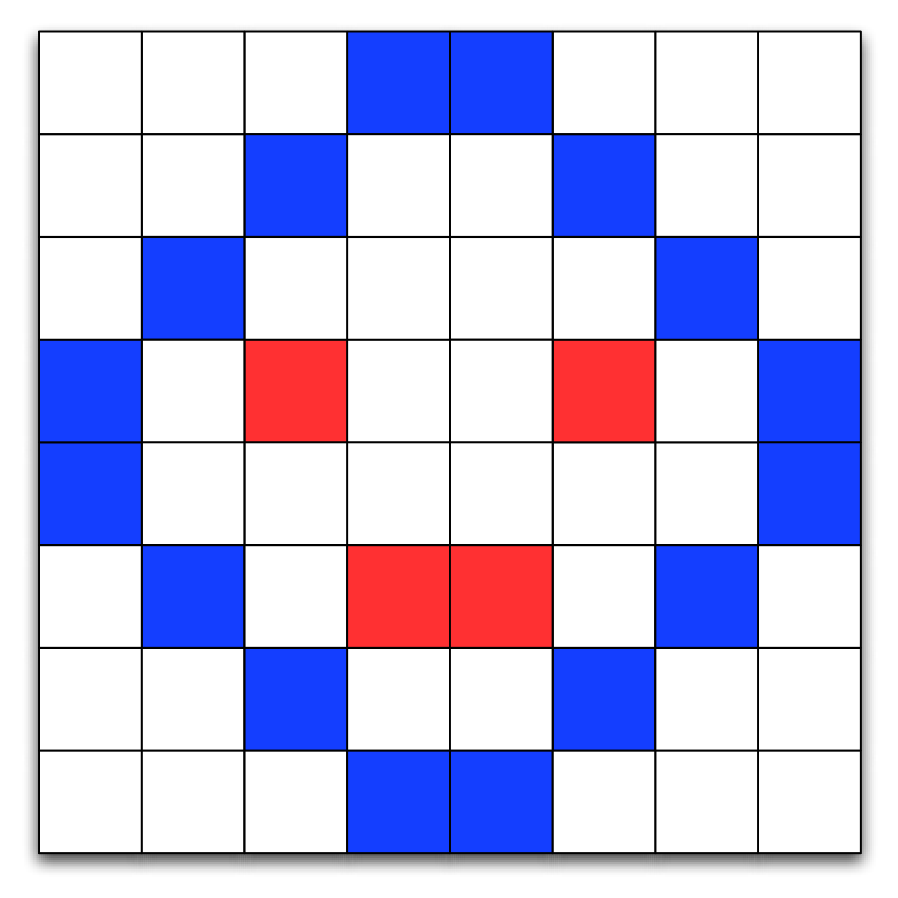

# 8.5. 树再探：图像量化

**8.5. Trees Revisited: Quantizing Images**

=== "中文"

    在文本之外，数字图像是互联网上最常见的元素。然而，如果每个广告尺寸的图像都需要 196,560 字节的内存，互联网的速度会显得非常慢。相反，一个横幅广告图像只需要 14,246 字节，仅为其可能占用内存的 7.2%。这些数字从哪里来？如何实现如此巨大的节省？这些问题的答案就是本节的主题。

=== "英文"
    
    Next to text, digital images are the most common element found on the internet. However, the internet would feel much slower if every advertisement-sized image required 196,560 bytes of memory. Instead, a banner ad image requires only 14,246, just 7.2% of what it could take. Where do these numbers come from? How is such a phenomenal savings achieved? The answers to these questions are the topic of this section.


## 8.5.1. 数字图像快速回顾

**8.5.1. A Quick Review of Digital Images**

=== "中文"
    
    数字图像由成千上万的个体组件组成，这些组件称为 **像素**。像素排列成一个矩形，形成图像。图像中的每个像素代表图像中的一种特定颜色。在计算机上，每个像素的颜色是由三种基本颜色的混合决定的：红色、绿色和蓝色。`图1` 展示了一个像素如何排列以形成图像的简单示例。
    
    <figure markdown="span">
        
        <figcaption markdown="span">图1：由像素组成的简单图像</figcaption>
    </figure>
    
    在物理世界中，颜色不是离散的数量。我们物理世界中的颜色有无限的变化。就像计算机必须近似浮点数一样，它们也必须近似图像中的颜色。人眼可以区分每种基本颜色中的 200 个不同级别，总共大约 800 万种颜色。在实践中，我们使用一个字节（8 位）内存来表示像素的每个颜色分量。八个位为红色、绿色和蓝色分量分别提供了 256 个不同的级别，每个像素总共可以表示 1670 万种不同的颜色。虽然大量的颜色允许艺术家和图形设计师创建出精美细致的图像，但这些颜色的可能性带来的缺点是图像大小会迅速增长。例如，一张来自一百万像素相机的单张图像将占用 3 兆字节的内存。
    
    在 Python 中，我们可以使用一个包含元组的列表列表来表示图像，其中每个元组包含三个介于 0 和 255 之间的数字，分别代表红色、绿色和蓝色分量。在其他语言中，如 C++ 和 Java，图像可以表示为一个二维数组。`图1` 中前两行图像的列表列表表示如下所示：
    
    ```python
    im = [[(255,255,255),(255,255,255),(255,255,255),(12,28,255),
            (12,28,255),(255,255,255),(255,255,255),(255,255,255),],
            [(255,255,255),(255,255,255),(12,28,255),(255,255,255),
            (255,255,255),(12,28,255),(255,255,255),(255,255,255)],
    ... ]
    ```
    
    颜色白色由元组 $(255, 255, 255)$ 表示。蓝色调由元组 $(12, 28, 255)$ 表示。您可以通过简单地使用列表索引来获取图像中任何像素的颜色值，例如：
    
    ```pycon
    >>> im[3][2]
    (255, 18, 39)
    ```
    
    考虑到这种图像表示方式，您可以想象将图像存储到文件中只需逐个像素地写入元组就会很容易。您可以首先写入图像的行数和列数，然后每行写入三个整数值。实际上，Python 包 ``Pillow`` 提供了一些强大的类。使用 ``Image`` 类，我们可以使用 ``getpixel((col, row))`` 和 ``putpixel((col, row), color)`` 来获取和设置像素。请注意，图像方法的参数是传统的 $x, y$ 顺序，但许多人会忘记而以行、列的顺序思考。

=== "英文"

    A digital image is composed of thousands of individual components called
    **pixels**. The pixels are arranged as a rectangle that forms the image.
    Each pixel in an image represents a particular color in the image. On a
    computer, the color of each pixel is determined by a mixture of three
    primary colors: red, green, and blue. A simple example of how pixels are
    arranged to form a picture is shown in `Figure 1`.
    
    <figure markdown="span">
        
        <figcaption markdown="span">Figure 1: A Simple Image Composed of Pixels</figcaption>
    </figure>
    
    In the physical world colors are not discrete quantities. The colors in our physical world have an infinite amount of variation to them. Just as computers must approximate floating point numbers, they also must approximate the colors in an image. The human eye can distinguish between 200 different levels in each of the three primary colors, or a total of about 8 million individual colors. In practice we use one byte (8 bits) of memory for each color component of a pixel. Eight bits gives us 256 different levels for each of the red, green, and blue components, for a total of 16.7 million different possible colors for each pixel. While the huge number of colors allows artists and graphic designers to create wonderfully detailed images, the downside of all of these color possibilities is that image size grows very rapidly. For example, a single image from a one-megapixel camera would take 3 megabytes of memory.
    
    In Python we might represent an image using a list of a list of tuples, where the tuples consist of three numbers between 0 and 255, one for each of the red, green, and blue components. In other languages, such as C++ and Java, an image could be represented as a two-dimensional array. The list of lists representation of the first two rows of the image in `Figure 1` is shown below:
    
    ```python
    im = [[(255,255,255),(255,255,255),(255,255,255),(12,28,255),
            (12,28,255),(255,255,255),(255,255,255),(255,255,255),],
            [(255,255,255),(255,255,255),(12,28,255),(255,255,255),
            (255,255,255),(12,28,255),(255,255,255),(255,255,255)],
    ... ]
    ```
    
    The color white is represented by the tuple $(255, 255, 255)$. A bluish color is represented by the tuple $(12, 28, 255)$. You can obtain the color value for any pixel in the image by simply using list indices, for example:
    
    ```pycon
    >>> im[3][2]
    (255, 18, 39)
    ```
    
    With this representation for an image in mind, you can imagine that it would be easy to store an image to a file just by writing a tuple for each pixel. You might start by writing the number of rows and columns in the image and then by writing three integer values per line. In practice, the Python package ``Pillow`` provides us with some powerful classes. Using the ``Image`` class we can get and set pixels using ``getpixel((col, row))`` and ``putpixel((col, row), color)``. Note that the parameters for the image methods are in the traditional $x, y$ order but many people forget and think in terms of row, column order.


## 8.5.2. 图像量化

**8.5.2. Quantizing an Image**

=== "中文"

    有很多方法可以减少图像的存储需求。其中一种最简单的方法就是使用更少的颜色。颜色选择越少，每个红色、绿色和蓝色分量所需的位数就越少，从而减少内存需求。事实上，最常用于万维网图像的图像格式之一只使用 256 种颜色。使用 256 种颜色将每个像素的存储需求从 3 字节减少到 1 字节。
    
    现在你可能会问，如何将可能有 1600 万种颜色的图像减少到仅 256 种颜色呢？答案是一个叫做 **量化** 的过程。为了理解量化过程，我们可以把颜色看作是一个三维空间。每种颜色都可以用空间中的一个点来表示，其中红色分量是 *x* 轴，绿色分量是 *y* 轴，蓝色分量是 *z* 轴。我们可以把所有可能颜色的空间看作是一个 $256 \times 256 \times 256$ 的立方体。最接近 $(0, 0, 0)$ 顶点的颜色将是黑色和深色阴影。最接近 $(255, 255, 255)$ 顶点的颜色将是明亮的、接近白色的。最接近 $(255, 0, 0)$ 的颜色将是红色，依此类推。
    
    最简单的量化图像的方式是将 $256 \times 256 \times 256$ 的立方体转换为一个 $8 \times 8 \times 8$ 的立方体。立方体的总体大小保持不变，但现在旧立方体中的许多颜色由新立方体中的单一颜色表示。`图2` 展示了刚才描述的量化示例。
    
    <figure markdown="span">
        
        <figcaption markdown="span">图2：颜色量化</figcaption>
    </figure>
    
    我们可以将这种简单的颜色量化思想转换为 `Listing lst_simplequant` 中显示的 Python 程序。``simple_quant`` 算法通过将每个像素的颜色分量（用完整的 256 位表示）映射到其区域中心的颜色来实现。这在 Python 中很容易通过整数除法来完成。在 ``simple_quant`` 算法中，红色维度有七个不同的值，绿色和蓝色维度有六个不同的值。
    
    ```python title="Listing lst_simplequant"
    from PIL import Image
    
    
    def simple_quant(filename):
        im = Image.open(filename)
        w, h = im.size
        for row in range(h):
            for col in range(w):
                r, g, b = im.getpixel((col, row))
                r = r // 36 * 36
                g = g // 42 * 42
                b = b // 42 * 42
                im.putpixel((col, row), (r, g, b))
        im.show()
    
    simple_quant("bubbles.jpg")
    ```
    
    `图2` 显示了原始图像和量化图像的前后对比。自然，这些是被转换为灰度图以便发布的彩色图像。你可以使用你收藏中的任何 JPEG 彩色图像并运行程序，以查看全彩色的实际差异。注意量化图像中丢失了多少细节。草地的细节几乎全部丢失，变得均匀绿色，而肤色则减少到两种棕褐色的阴影。

=== "英文"

    There are many ways of reducing the storage requirements for an image. One of the easiest ways is to simply use fewer colors. Fewer color choices means fewer bits for each red, green, and blue component, which means reduced memory requirements. In fact, one of the most popular image formats used for images on the World Wide Web uses only 256 colors for an image. Using 256 colors reduces the storage requirements from three bytes per pixel to one byte per pixel.
    
    Right now you are probably asking yourself how to take an image that  may have as many as 16 million colors and reduce it to just 256? The answer is a process called **quantization**. To understand the process of quantization let’s think about colors as a three-dimensional space. Each color can be represented by a point in space where the red component is the *x* axis, the green component is the *y* axis, and the blue component is the *z* axis. We can think of the space of all possible colors as a $256 \times 256 \times 256$ cube. The colors closest to the vertex at $(0, 0, 0)$ are going to be black and dark color shades. The colors closest to the vertex at $(255, 255, 255)$ are bright and close to white. The colors closest to $(255, 0, 0)$ are red and so forth.
    
    The simplest way to think about quantizing an image is to imagine taking the $256 \times 256 \times 256$ cube and turning it into an $8 \times 8 \times 8$ cube. The overall size of the cube stays the same, but now many colors in the old cube are represented by a single color in the new cube. `Figure 2` shows an example of the quantization just described.
    
    <figure markdown="span">
        
        <figcaption markdown="span">Figure 2: Color Quantization</figcaption>
    </figure>
    
    We can turn this simple idea of color quantization into the Python program shown in `Listing lst_simplequant`. The ``simple_quant`` algorithm works by mapping the color components for each pixel represented by its full 256 bits to the color at the center of the cube in its area. This is easy to do using integer division in Python. In the ``simple_quant`` algorithm there are seven distinct values in the red dimension and six distinct values in the green and blue dimensions.
    
    ```python title="Listing lst_simplequant"
    from PIL import Image
    
    
    def simple_quant(filename):
        im = Image.open(filename)
        w, h = im.size
        for row in range(h):
            for col in range(w):
                r, g, b = im.getpixel((col, row))
                r = r // 36 * 36
                g = g // 42 * 42
                b = b // 42 * 42
                im.putpixel((col, row), (r, g, b))
        im.show()
    
    simple_quant("bubbles.jpg")
    ```
    
    `Figure 2` shows a before and after comparison of original and quantized images. Of course, these are color pictures that have been converted to gray scale for publication. You can use any JPEG color image from your collection and run the program to see the real difference in full color. Notice how much detail is lost in the quantized picture. The grass has lost nearly all its detail and is uniformly green, and the skin tones have been reduced to two shades of tan.

## 8.5.3. 使用八叉树的改进量化算法

**8.5.3. An Improved Quantization Algorithm Using Octrees**

=== "中文"

    简单的量化方法存在的问题是大多数图像中的颜色并不是均匀分布在整个颜色立方体中的。许多颜色可能在图像中并不存在，因此立方体的一部分可能完全没有使用。将未使用的颜色分配给量化图像是一种浪费。`图3` 显示了在示例图像中使用的颜色分布。注意颜色立方体空间中实际使用的部分是多么少。
    
    <figure markdown="span">
        
        <figcaption markdown="span">图3：图像中使用的颜色在颜色立方体中的点图</figcaption>
    </figure>
    
    为了制作更好的量化图像，我们需要找到一种更有效的方法来选择用于表示图像的颜色集合。有几种算法可以以不同的方式划分颜色立方体，以便更好地利用颜色。在这一节中，我们将探讨一种基于树的方法。我们将使用的树形解决方案利用了 **八叉树**。八叉树类似于二叉树；然而，八叉树中的每个节点都有八个子节点。以下是我们将实现的八叉树抽象数据类型的接口：
    
    - ``Octree()`` 创建一个新的空八叉树。
    - ``insert(r, g, b)`` 使用红色、绿色和蓝色颜色值作为键，将新节点添加到八叉树中。
    - ``find(r, g, b)`` 使用红色、绿色和蓝色颜色值作为搜索键，查找现有节点或最接近的近似节点。
    - ``reduce(n)`` 减少八叉树的大小，使其叶节点数量不超过 $n$ 个。
    
    下面是如何使用八叉树划分颜色立方体的方式：
    
    - 八叉树的根节点代表整个立方体。
    - 八叉树的第二层代表一个穿过每个维度 ($x$, $y$, 和 $z$) 的单一切片，将立方体均匀地划分成八个部分。
    - 树的下一个层级将每个八个子立方体进一步划分成八个额外的立方体，总共形成 64 个立方体。注意，父节点表示的立方体完全包含了所有子节点表示的子立方体。随着我们沿树的路径向下移动，我们始终在父节点的边界内，但对立方体的具体部分越来越明确。
    - 第八层树代表我们颜色立方体中的 1670 万种颜色的全分辨率。
    
    现在你知道了如何使用八叉树来表示颜色立方体，你可能会觉得八叉树只是另一种将颜色立方体划分成均匀部分的方法。你是对的。然而，由于八叉树是层次化的，我们可以利用这种层次结构来使用较大的立方体表示颜色立方体中未使用的部分，而使用较小的立方体来表示常见的颜色。以下是我们将如何使用八叉树更好地选择图像颜色子集的概述：
    
    1. 对于图像中的每个像素：
    
        1. 在八叉树中搜索该像素的颜色。颜色将是第八层的叶节点。
        2. 如果找不到该颜色，则在第八层创建一个新的叶节点（并可能在叶节点上方创建一些内部节点）。
        3. 如果颜色已存在于树中，则增加叶节点中的计数器，以跟踪该颜色的像素数量。
    
    2. 重复直到叶节点的数量小于或等于目标颜色数量。
    
        1. 找到具有最少使用次数的最深叶节点。
        2. 合并该叶节点及其所有兄弟节点，形成一个新的叶节点。
    
    3. 剩余的叶节点形成该图像的颜色集。
    
    4. 要将原始颜色映射到其量化值，只需沿树向下搜索直到到达叶节点。返回存储在叶节点中的颜色值。
    
    以上概念被编码为 Python 函数，用于读取、量化和显示图像，见 `Listing lst_bad` 中的 `build_and_display()` 函数。
    
    ```python title="Listing lst_bad" linenums="1"
    def build_and_display(filename):
        img = Image.open(filename)
        w, h = img.size
        ot = Octree()
        for row in range(h):
            for col in range(w):
                r, g, b = img.getpixel((col, row))
                ot.insert(r, g, b)
        ot.reduce(256)
    
        for row in range(h):
            for col in range(w):
                r, g, b = img.getpixel((col, row))
                nr, ng, nb = ot.find(r, g, b)
                img.putpixel((col, row), (nr, ng, nb))
        img.show()
    ```
    
    ``build_and_display`` 函数遵循刚才描述的基本过程。首先，第 5–8 行的循环读取每个像素并将其添加到八叉树中。接着，第 9 行的 ``reduce`` 方法减少叶节点的数量。最后，第 14 行使用 ``find`` 方法在减少后的八叉树中搜索颜色，更新图像。
    
    我们使用 Python 图像库来打开现有图像文件（``Image.open``）、读取像素（``getpixel``）、写入像素（``putpixel``）以及将结果显示到屏幕上（``show``）。``build_and_display`` 函数通过 ``Octree`` 类的实例与八叉树进行交互（见 `Listing lst_octreedef`）。
    
    ```python title="Listing lst_octreedef" linenums="1"
    class Octree:
        def __init__(self):
            self.root = None
            self.max_level = 5
            self.num_leaves = 0
            self.all_leaves = []
    
        def insert(self, r, g, b):
            if not self.root:
                self.root = self.OTNode(outer=self)
            self.root.insert(r, g, b, 0, self)
    
        def find(self, r, g, b):
            if self.root:
                return self.root.find(r, g, b, 0)
    
        def reduce(self, max_cubes):   # line_otreduce
            while len(self.all_leaves) > max_cubes:
                smallest = self.find_min_cube()
                smallest.parent.merge()  # line_otredmerge
                self.all_leaves.append(smallest.parent)
                self.num_leaves = self.num_leaves + 1
    
        def find_min_cube(self):
            min_count = sys.maxsize
            max_level = 0
            min_cube = None
            for i in self.all_leaves:
                if (
                    i.count <= min_count
                    and i.level >= max_level
                ):
                    min_cube = i
                    min_count = i.count
                    max_level = i.level
            return min_cube
    ```
    
    首先注意到，``Octree`` 类的构造函数将根节点初始化为 ``None``。接着，它设置了三个重要的属性，这些属性是八叉树的所有节点可能需要访问的。这些属性是 ``max_level``、``num_leaves`` 和 ``all_leaves``。``max_level`` 属性限制了树的总深度。注意，在我们的实现中，我们将 ``max_level`` 初始化为 5。这是一个小优化，它使我们可以忽略颜色信息的两个最低有效位。这样可以保持树的整体大小较小，并且不会影响最终图像的质量。``num_leaves`` 和 ``all_leaves`` 属性使我们能够跟踪叶节点的数量，并允许我们直接访问叶节点，而无需遍历整棵树。我们稍后会看到这为什么很重要。
    
    ``insert`` 和 ``find`` 方法的行为与第 [chap_tree](../c6/index.md) 章中的类似方法完全一致。它们各自检查是否存在根节点，然后调用根节点中的相应方法。注意，``insert`` 和 ``find`` 都使用红色、绿色和蓝色组件（``(r, g, b)``）来识别树中的节点。
    
    ``reduce`` 方法在 `Listing lst_octreedef` 的 `[lst_octreedef:line_otreduce]` 行定义。该方法简单地循环，直到叶节点列表中的节点数量小于我们希望在最终图像中拥有的颜色总数（由 ``max_cubes`` 参数定义）。``reduce`` 使用辅助函数 ``find_min_cube`` 来找到八叉树中引用计数最小的节点。一旦找到最小引用计数的节点，该节点与所有兄弟节点合并成一个新节点（见 `[lst_octreedef:line_otredmerge]` 行）。
    
    ``find_min_cube`` 方法使用 ``all_leaves`` 和一个简单的最小查找循环模式实现。当叶节点的数量很大时，可能达到 1670 万，这种方法效率不高。在一个练习中，你将被要求修改 ``Octree`` 类以提高 ``find_min_cube`` 的效率。
    
    关于 ``Octree`` 类的一个要点是，它使用了在 ``Octree`` 类内部定义的 ``OTNode`` 类的实例。一个在另一个类内部定义的类称为 *内嵌类*。我们将 ``OTNode`` 定义在 ``Octree`` 内部，因为八叉树的每个节点需要访问存储在 ``Octree`` 类实例中的某些信息。另一个将 ``OTNode`` 设为内嵌类的原因是没有必要让 ``Octree`` 类外部的任何代码使用它。八叉树的实现方式实际上是一个私有细节，其他人不需要了解。这是一种良好的软件工程实践，称为 *信息隐藏*。
    
    现在让我们看看八叉树中节点的类定义（`Listing lst_otnodedef`）。``OTNode`` 类的构造函数有三个可选参数：``parent``、``level`` 和 ``outer``。这些参数允许 ``Octree`` 方法在各种情况下构建新节点。就像我们在二叉搜索树中做的那样，我们将显式跟踪节点的父节点。节点的层级简单地表示其在树中的深度。这三个参数中最有趣的是 ``outer`` 参数，它是对创建该节点的 ``Octree`` 类实例的引用。``outer`` 的作用类似于 ``self``，允许 ``OTNode`` 的实例访问 ``Octree`` 实例的属性。
    
    我们还需要记住 ``octree`` 中每个节点的其他属性，包括引用计数 ``count`` 和表示该树的颜色的红色、绿色和蓝色组件。正如你在 ``insert`` 函数中所看到的，只有叶节点才会有 ``red``、``green``、``blue`` 和 ``count`` 的值。还要注意，由于每个节点最多可以有八个子节点，因此我们初始化一个包含八个引用的列表以跟踪它们。与二叉树中的左子节点和右子节点不同，八叉树有 0–7 个子节点。
    
    ```python title="Listing lst_otnodedef" linenums="1"
    class OTNode:
        def __init__(self, parent=None, level=0, outer=None):
            self.red = 0
            self.green = 0
            self.blue = 0
            self.count = 0
            self.parent = parent
            self.level = level
            self.oTree = outer
            self.children = [None] * 8
    ```
    
    接下来，我们进入八叉树实现中非常有趣的部分。插入新节点到八叉树中的 Python 代码见 `Listing lst_otninsert`。我们需要解决的第一个问题是如何确定在树中放置新节点的位置。在二叉搜索树中，我们使用的规则是，具有小于其父节点的键的新节点放在左子树中，而具有大于其父节点的键的新节点放在右子树中。但对于每个节点有八个可能的子节点，这就不那么简单了。此外，在对颜色进行索引时，节点的键应该是什么也不明显。在 ``octree`` 中，我们将使用来自三个颜色组件的信息。`图4` 显示了如何使用红色、绿色和蓝色颜色值来计算新节点在树中每个层级的位置索引。计算索引的相应 Python 代码在 `Listing lst_otninsert` 的 `line_otci` 行中。
    
    ```python title="Listing lst_otninsert" linenums="1"
    def insert(self, r, g, b, level, outer):
        if level < self.oTree.max_level:
            idx = self.compute_index(
                r, g, b, level
            )
            if self.children[idx] == None:
                self.children[idx] = outer.OTNode(
                    parent=self,
                    level=level + 1,
                    outer=outer,
                )
            self.children[idx].insert(
                r, g, b, level + 1, outer
            )
        else:
            if self.count == 0:
                self.oTree.num_leaves = (
                    self.oTree.num_leaves + 1
                )
                self.oTree.all_leaves.append(self)
            self.red += r
            self.green += g
            self.blue += b
            self.count = self.count + 1
    
    def compute_index(self, r, g, b, l):  # line_otci
        shift = 8 - l
        rc = r >> shift - 2 & 0x4
        gc = g >> shift - 1 & 0x2
        bc = b >> shift & 0x1
        return rc | gc | bc
    ```
    
    计算索引将红色、绿色和蓝色组件中的位进行组合，从树的顶部开始，使用最高位。`图4` 显示了 163、98、231 的红色、绿色和蓝色组件的二进制表示。在树的根节点，我们从三个颜色组件中获取最重要的位；在这种情况下，三个位是 1、0 和 1。将这些位组合在一起，我们得到二进制 101 或十进制 5。你可以在 `Listing lst_otninsert` 的 `line_otci` 行中看到 ``compute_index`` 方法中对红色、绿色和蓝色数字的二进制操作。
    
    ``compute_index`` 方法中使用的运算符可能对你来说比较陌生。``>>`` 运算符是右移操作。``&`` 是按位 ``and``，而 ``|`` 是逻辑 ``or``。按位 ``or`` 和按位 ``and`` 操作的工作方式与条件语句中使用的逻辑操作类似，只是它们作用于数字的单个位。右移操作将位向右移动 $n$ 位，左侧用零填充，右侧的位会被丢弃。
    
    一旦计算出适合当前树层级的索引，我们就会向下遍历到子树。在 `图4` 的示例中，我们跟随 ``children`` 数组中位置 5 的链接。如果位置 5 处没有节点，我们会创建一个。我们继续向下遍历树，直到到达 ``max_level``。在 ``max_level`` 处，我们停止搜索并存储数据。注意，我们不会覆盖叶节点中的数据，而是将颜色组件添加到现有组件中，并增加引用计数器。这允许我们计算当前节点下方颜色的平均值。通过这种方式，``octree`` 中的一个叶节点可能表示颜色立方体中的多个相似颜色。
    
    <figure markdown="span">
        
        <figcaption markdown="span">图4：计算索引以在八叉树中插入节点</figcaption>
    </figure>
    
    ``find`` 方法（见 `Listing lst_otnfind`）使用与 ``insert`` 方法相同的索引计算方法来遍历树，寻找匹配红色、绿色和蓝色组件的节点。
    
    ```python title="Listing lst_otnfind" linenums="1"
    def find(self, r, g, b, level):
        if level < self.oTree.max_level:
            idx = self.compute_index(r, g, b, level)
            if self.children[idx]:
                return self.children[idx].find(
                    r, g, b, level + 1
                )
            elif self.count > 0:
                return (
                    self.red // self.count,
                    self.green // self.count,
                    self.blue // self.count,
                )
            else:
                print("没有叶节点表示此颜色")
        else:
            return (
                self.red // self.count,
                self.green // self.count,
                self.blue // self.count,
            )
    ```
    
    ``find`` 方法有三个退出条件：
    
    1. 达到树的最大层级，因此返回该叶节点中存储的颜色信息的平均值（见第 17 至 21 行）。
    2. 在低于 ``max_level`` 的高度找到一个叶节点（见第 9 至 13 行）。这只有在树已被简化之后才可能发生。见下文。
    3. 试图跟随一个不存在的子树路径，这是一个错误。
    
    ``OTNode`` 类的最后一个方面是 ``merge`` 方法。它允许一个父节点合并所有子节点，并自己成为一个叶节点。如果你回顾一下 ``octree`` 的结构，其中每个父立方体完全包含所有由子节点表示的立方体，你会明白这样做的意义。当我们合并一组兄弟节点时，我们实际上是在对这些兄弟节点所代表的颜色进行加权平均。由于所有兄弟节点在颜色空间中相对接近，这种平均值很好地代表了它们。`图5` 说明了某些兄弟节点的合并过程。
    
    <figure markdown="span">
        
        <figcaption markdown="span">图5：合并八叉树的四个叶节点</figcaption>
    </figure>
    
    `图5` 显示了四个叶节点所代表的红色、绿色和蓝色组件，它们的标识颜色值分别是 (101, 122, 167)、(100, 122, 183)、(123, 108, 163) 和 (126, 113, 166)。正如你在 `Listing lst_otnfind` 中看到的，标识值是通过将颜色值除以计数计算得出的。注意它们在整个颜色空间中的接近程度。从这些叶节点创建的叶节点的 ID 是 (112, 115, 168)。这接近于四者的平均值，但由于第三个颜色元组的引用计数为 12，因此加权更多。
    
    ```python
    def merge(self):
        for child in [c for c in self.children if c]:
            if child.count > 0:
                self.o_tree.all_leaves.remove(child)
                self.o_tree.num_leaves -= 1
            else:
                print("递归合并非叶节点...")
                child.merge()
            self.count += child.count
            self.red += child.red
            self.green += child.green
            self.blue += child.blue
        for i in range(8):
            self.children[i] = None
    ```
    
    由于 ``octree`` 仅使用图像中真实存在的颜色，并忠实地保留了常用的颜色，最终从 ``octree`` 得到的量化图像的质量远高于我们在本节开始时使用的简单方法。`图2` 显示了原始图像与量化图像的比较。
    
    还有许多其他方法可以压缩图像，如游程编码、离散余弦变换和霍夫曼编码。这些算法都是你可以掌握的，我们鼓励你去查阅并了解它们。此外，量化图像还可以通过使用一种称为 **抖动** 的技术来改进。抖动是将不同颜色放置在一起，使眼睛将颜色混合在一起，从而形成更真实的图像。这是报纸使用的一个老技巧，通过使用黑色加上三种不同颜色的墨水来进行彩色印刷。你可以再次研究抖动并尝试将其应用到一些图像中。

=== "英文"

    The problem with the simple method of quantization just described is that the colors in most pictures are not evenly distributed throughout the color cube. Many colors may not appear in the image, so parts of the cube may go completely unused. Allocating an unused color to the quantized image is a waste. `Figure 3` shows the distribution of the colors that are used in the example image. Notice how little of the color cube space is actually used.
    
    <figure markdown="span">
        
        <figcaption markdown="span">Figure 3: Plot of Colors Used in Image as Points in Color Cube</figcaption>
    </figure>   
    
    To make a better quantized image we need to find a way to do a better job of selecting the set of colors we want to use to represent our image. There are several algorithms for dividing the color cube in different ways to allow for the better use of colors. In this section we are going to look at a tree-based solution. The tree solution we will use makes use of an **octree**. An octree is similar to a binary tree; however, each node in an octree has eight children. Here is the interface we will implement for our octree abstract data type:
    
    -  ``Octree()`` creates a new empty octree.
    -  ``insert(r, g, b)`` adds a new node to the octree using the red, green, and blue color values as the key.
    -  ``find(r, g, b)`` finds an existing node, or the closest approximation, using the red, green, and blue color values as the search key.
    -  ``reduce(n)`` reduces the size of the octree so that there are $n$ or fewer leaf nodes.
    
    Here is how an octree is used to divide the color cube:
    
    -  The root of the octree represents the entire cube.
    -  The second level of the octree represents a single slice through each dimension ($x$, $y$, and $z$) that evenly divides the cube into eight pieces.
    -  The next level of the tree divides each of the eight sub-cubes into eight additional cubes for a total of 64 cubes. Notice that the cube represented by the parent node totally contains all of the sub-cubes represented by the children. As we follow any path down the tree we are staying within the boundary of the parent, but getting progressively more specific about the portion of the cube.
    -  The eighth level of the tree represents the full resolution of 16.7 million colors in our color cube.
    
    Now that you know how we can represent the color cube using an octree, you may be thinking that the octree is just another way to divide up the color cube into even parts. You are correct. However, because the octree is hierarchical, we can take advantage of the hierarchy to use larger cubes to represent unused portions of the color cube and smaller cubes to represent the popular colors. Here is an overview of how we will use an octree to do a better job of selecting a subset of the colors in an image:
    
    1. For each pixel in the image:
    
        1. Search for the color of this pixel in the octree. The colo will be a leaf node at the eighth level.
        2. If the color is not found create a new leaf node at the eighth level (and possibly some internal nodes above the leaf).
        3. If the color is already present in the tree increment the counter in the leaf node to keep track of how many pixels are this color.
    
    2. Repeat until the number of leaf nodes is less than or equal to the target number of colors.
    
        1. Find the deepest leaf node with the smallest number of uses.
        2. Merge the leaf node and all of its siblings together to form a new leaf node.
    
    3. The remaining leaf nodes form the color set for this image.
    
    4. To map an original color to its quantized value simply search down the tree until you get to a leaf node. Return the color values stored in the leaf.
    
    The ideas outlined above are encoded as a Python function to read, quantize, and display an image in the function ``build_and_display()`` in `Listing lst_bad`.
    
    ```python title="Listing lst_bad" linenums="1"
    def build_and_display(filename):
        img = Image.open(filename)
        w, h = img.size
        ot = Octree()
        for row in range(h):
            for col in range(w):
                r, g, b = img.getpixel((col, row))
                ot.insert(r, g, b)
        ot.reduce(256)
    
        for row in range(h):
            for col in range(w):
                r, g, b = img.getpixel((col, row))
                nr, ng, nb = ot.find(r, g, b)
                img.putpixel((col, row), (nr, ng, nb))
        img.show()
    ```
    
    The ``build_and_display`` function follows the basic process just described. First, the loops in lines 5–8 read each pixel and add it to the octree. Second, the number of leaf nodes is reduced by the ``reduce`` method on line 9. Finally, the image is updated by searching for a color, using ``find``, in the reduced octree on line 14.
    
    We are using the Python image library to open an existing image file (``Image.open``), read a pixel (``getpixel``), write a pixel (``putpixel``), and display the result to the screen (``show``). ``build_and_display`` interacts with the octree using an instance of the ``Octree`` class (`Listing lst_octreedef`).
    
    ```python title="Listing lst_octreedef" linenums="1"
    class octree:
        def __init__(self):
            self.root = None
            self.max_level = 5
            self.num_leaves = 0
            self.all_leaves = []
    
        def insert(self, r, g, b):
            if not self.root:
                self.root = self.OTNode(outer=self)
            self.root.insert(r, g, b, 0, self)
    
        def find(self, r, g, b):
            if self.root:
                return self.root.find(r, g, b, 0)
    
        def reduce(self, max_cubes):   # line_otreduce
            while len(self.all_leaves) > max_cubes:
                smallest = self.find_min_cube()
                smallest.parent.merge()  # line_otredmerge
                self.all_leaves.append(smallest.parent)
                self.num_leaves = self.num_leaves + 1
    
        def find_min_cube(self):
            min_count = sys.maxsize
            max_level = 0
            min_cube = None
            for i in self.all_leaves:
                if (
                    i.count <= min_count
                    and i.level >= max_level
                ):
                    min_cube = i
                    min_count = i.count
                    max_level = i.level
            return min_cube
    ```
    
    First notice that the constructor for an ``Octree`` initializes the root node to ``None``. Then it sets up three important attributes that all the nodes of an octree may need to access. Those attributes are ``max_level``, ``num_leaves``, and ``all_leaves``. The ``max_level`` attribute limits the total depth of the tree. Notice that in our implementation we have initialized ``max_level`` to five. This is a small optimization that simply allows us to ignore the two least significant bits of color information. It keeps the overall size of the tree much smaller and doesn’t hurt the quality of the final image at all. The ``num_leaves`` and ``all_leaves`` attributes allow us to keep track of the number of leaf nodes and allow us direct access to the leaves without traversing all the way down the tree. We will see why this is important shortly.
    
    The ``insert`` and ``find`` methods behave exactly like their cousins in chapter [chap_tree](../c6/index.md). They each check to see if a root node exists, and then call the corresponding method in the root node. Notice that ``insert`` and ``find`` both use the red, green, and blue components (``(r, g, b)``) to identify a node in the tree.
    
    The ``reduce`` method is defined on line `[lst_octreedef:line_otreduce]` of `Listing lst_octreedef`. This method simply loops until the number of leaves in the leaf list is less than the total number of colors we want to have in the final image (defined by the parameter ``max_cubes``). ``reduce`` makes use of a helper function ``find_min_cube`` to find the node in the octree with the smallest reference count. Once the node with the smallest reference count is found, that node is merged into a single node with all of its siblings (see line `[lst_octreedef:line_otredmerge]`).
    
    The ``find_min_cube`` method is implemented using the ``all_leaves`` and a simple find minimum loop pattern. When the number of leaf nodes is large, and it could be as large is 16.7 million, this approach is not very efficient. In one of the exercises you are asked to modify the ``Octree`` class and improve the efficiency of ``find_min_cube``.
    
    One of the things to mention about the ``Octree`` class is that it uses an instance of the class ``OTNode`` which is defined inside the the ``Octree`` class. A class that is defined inside another class is called an *inner class*. We define ``OTNode`` inside ``Octree`` because each node of an octree needs to have access to some information that is stored in an instance of the ``Octree`` class. Another reason for making ``OTNode`` an inner class is that there is no reason for any code outside of the ``Octree`` class to use it. The way that an octree is implemented is really a private detail that nobody else needs to know about. This is a good software engineering practice known as *information hiding*.
    
    Now let’s look at the class definition for the nodes in an octree (`Listing lst_otnodedef`). The constructor for the ``OTNode`` class has three optional parameters: ``parent``, ``level``, and ``outer``. These parameters allow the ``Octree`` methods to construct new nodes under a variety of circumstances. As we did with binary search trees, we will keep track of the parent of a node explicitly. The level of the node simply indicates its depth in the tree. The most interesting of these three parameters is the ``outer`` parameter, which is a reference to the instance of the ``octree`` class that created this node. ``outer`` will function like ``self`` in that it will allow the instances of ``OTNode`` to access attributes of an instance of ``Octree``.
    
    The other attributes that we want to remember about each node in an ``octree`` include the reference ``count`` and the red, green, and blue components of the color represented by this tree. As you will note in the ``insert`` function, only a leaf node of the tree will have values for ``red``, ``green``, ``blue``, and ``count``. Also note that since each node can have up to eight children we initialize a list of eight references to keep track of them all. Rather than a left and right child as in binary trees, an octree has 0–7 children.
    
    ```python title="Listing lst_otnodedef" linenums="1"
    class OTNode:
        def __init__(self, parent=None, level=0, outer=None):
            self.red = 0
            self.green = 0
            self.blue = 0
            self.count = 0
            self.parent = parent
            self.level = level
            self.oTree = outer
            self.children = [None] * 8
    ```
    
    Now we get into the really interesting parts of the octree implementation. The Python code for inserting a new node into an octree is shown in `Listing lst_otninsert`. The first problem we need to solve is how to figure out where to place a new node in the tree. In a binary search tree we used the rule that a new node with a key less than its parent went in the left subtree, and a new node with a key greater than its parent went in the right subtree. But with eight possible children for each node it is not that simple. In addition, when indexing colors it is not obvious what the key for each node should be. In an ``octree`` we will use the information from the three color components. `Figure 4` shows how we can use the red, green, and blue color values to compute an index for the position of the new node at each level of the tree. The corresponding Python code for computing the index is on line `line_otci` of `Listing lst_otninsert`.
    
    ```python title="Listing lst_otninsert" linenums="1"
    def insert(self, r, g, b, level, outer):
        if level < self.oTree.max_level:
            idx = self.compute_index(
                r, g, b, level
            )
            if self.children[idx] == None:
                self.children[idx] = outer.OTNode(
                    parent=self,
                    level=level + 1,
                    outer=outer,
                )
            self.children[idx].insert(
                r, g, b, level + 1, outer
            )
        else:
            if self.count == 0:
                self.oTree.num_leaves = (
                    self.oTree.num_leaves + 1
                )
                self.oTree.all_leaves.append(self)
            self.red += r
            self.green += g
            self.blue += b
            self.count = self.count + 1
    
    def compute_index(self, r, g, b, l):  # line_otci
        shift = 8 - l
        rc = r >> shift - 2 & 0x4
        gc = g >> shift - 1 & 0x2
        bc = b >> shift & 0x1
        return rc | gc | bc
    ```
    
    The computation of the index combines bits from each of the red, green, and blue color components, starting at the top of the tree with the highest order bits. `Figure 4` shows the binary representation of the red, green, and blue components of 163, 98, 231. At the root of the tree we start with the most significant bit from each of the three color components; in this case the three bits are 1, 0, and 1. Putting these bits together we get binary 101 or decimal 5. You can see the binary manipulation of the red, green, and blue numbers in the ``compute_index`` method on line `line_otci` in `Listing lst_otninsert`.
    
    The operators used in the ``compute_index`` may be unfamiliar to you. The ``>>`` operator is the right shift operation. The ``&`` is bitwise ``and``, and ``|`` is logical ``or``. The bitwise ``or`` and bitwise ``and`` operations work just like the logical operations used in conditionals, except that they work on the individual bits of a number. The shift operation simply moves the bits $n$ places to the right, filling in with zeros on the left and dropping the bits as they go off the right.
    
    Once we have computed the index appropriate for the current level of the tree, we traverse down into the subtree. In the example in `Figure 4` we follow the link at position 5 in the ``children`` array. If there is no node at position 5, we create one. We keep traversing down the tree until we get to ``max_level``. At ``max_level`` we stop searching and store the data. Notice that we do not overwrite the data in the leaf node, but rather we add the color components to any existing components and increment the reference counter. This allows us to compute the average of any color below the current node in the color cube. In this way, a leaf node in the ``octree`` may represent a number of similar colors in the color cube.
    
    <figure markdown="span">
        
        <figcaption markdown="span">Figure 4: Computing an Index to Insert a Node in an octree</figcaption>
    </figure>
    
    The ``find`` method, shown in `Listing lst_otnfind`, uses the same method of index computation as the ``insert`` method to traverse the tree in search of a node matching the red, green, and blue components. 
    
    ```python title="Listing lst_otnfind" linenums="1"
    def find(self, r, g, b, level):
        if level < self.oTree.max_level:
            idx = self.compute_index(r, g, b, level)
            if self.children[idx]:
                return self.children[idx].find(
                    r, g, b, level + 1
                )
            elif self.count > 0:
                return (
                    self.red // self.count,
                    self.green // self.count,
                    self.blue // self.count,
                )
            else:
                print("No leaf node to represent this color")
        else:
            return (
                self.red // self.count,
                self.green // self.count,
                self.blue // self.count,
            )
    ```
    
    The ``find`` method has three exit conditions:
    
    1. We have reached the maximum level of the tree and so we return the average of the color information stored in this leaf node (see lines 17--21).
    2. We have found a leaf node at a height less than ``max_level`` (see lines 9--13). This is possible only after the tree has been reduced. See below.
    3. We try to follow a path into a nonexistent subtree, which is an error.
    
    The final aspect of the ``OTNode`` class is the ``merge`` method. It allows a parent to subsume all of its children and become a leaf node itself. If you remember back to the structure of the ``octree`` where each parent cube fully encloses all the cubes represented by the children, you will see why this makes sense. When we merge a group of siblings we are effectively taking a weighted average of the colors represented by each of those siblings. Since all the siblings are relatively close to each other in color space, the average is a good representation of all of them. `Figure 5` illustrates the merge process for some sibling nodes.
    
    <figure markdown="span">
        
        <figcaption markdown="span">Figure 5: Merging Four Leaf Nodes of an ``octree``</figcaption>
    </figure>
    
    `Figure 5` shows the red, green, and blue components represented by the four leaf nodes whose identifying color values are (101, 122, 167), (100, 122, 183), (123, 108, 163), and (126, 113, 166). As you can see in `Listing lst_otnfind`the identifying values are calculated dividing the color values by the count. Notice how close they are in the overall color space. The leaf node that gets created from all of these has an ID of (112, 115, 168). This is close to the average of the four, but weighted more towards the third color tuple due to the fact that it had a reference count of 12.
    
    ```python
    def merge(self):
        for child in [c for c in self.children if c]:
            if child.count > 0:
                self.o_tree.all_leaves.remove(child)
                self.o_tree.num_leaves -= 1
            else:
                print("Recursively merging non-leaf...")
                child.merge()
            self.count += child.count
            self.red += child.red
            self.green += child.green
            self.blue += child.blue
        for i in range(8):
            self.children[i] = None
    ```
    
    Because the ``octree`` uses only colors that are really present in the image and faithfully preserves colors that are often used, the final quantized image from the ``octree`` is much higher quality than the simple method we used to start this section. `Figure 2` shows a comparison of the original image with the quantized image.
    
    There are many additional ways to compress images using techniques such as run-length encoding, discrete cosine transform, and Huffman coding. Any of these algorithms are within your grasp and we encourage you to look them up and read about them. In addition, quantized images can be improved by using a technique known as **dithering**. Dithering is a process by which different colors are placed near each other so that the eye blends the colors together, forming a more realistic image. This is an old trick used by newspapers for doing color printing using just black plus three different colors of ink. Again you can research dithering and try to apply it to some images on your own.