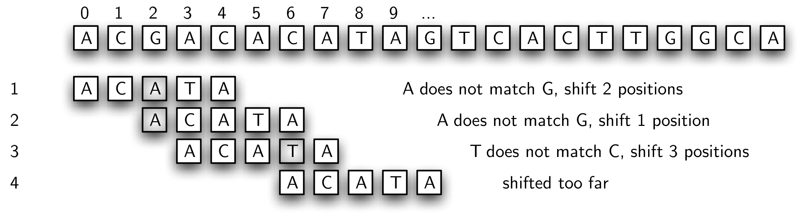
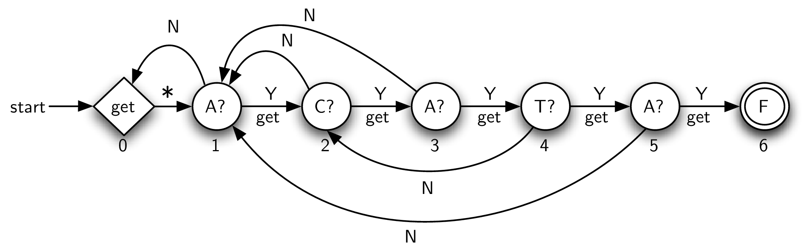

# 8.6. 图再探：模式匹配

**8.6. Graphs Revisited: Pattern Matching**

=== "中文"

    即使在计算机图形学日益受到关注的今天，处理文本信息仍然是一个重要的研究领域。特别感兴趣的是在长字符串中查找模式（通常称为 **子串**）的问题。任务是执行某种搜索，以便至少找到第一次出现该模式的位置。我们还可以考虑将此问题扩展为查找所有这样的出现位置。
    
    Python 内置了一个名为 ``find`` 的子串方法，它返回给定字符串中第一次出现模式的位置。例如：
    
    ```pycon
    >>> "ccabababcab".find("ab")
    2
    >>> "ccabababcab".find("xyz")
    -1
    >>>
    ```
    
    这表明子串 ``"ab"`` 在字符串 ``"ccabababcab"`` 中第一次出现的起始索引位置是 ``2``。如果模式不存在，``find`` 也会返回 ``-1``。

=== "英文"

    Even with the growing interest in computer graphics, processing textual information is still an important area of study. Of particular interest here is the problem of finding patterns, often referred to as **substrings**, that exist in long strings of characters. The task is to perform some type of search that can identify at least the first occurrence of the pattern. We can also consider an extension of this problem to find all such occurrences.
    
    Python includes a built-in substring method called ``find`` that returns the location of the first occurrence of a pattern in a given string. For example,
    
    ```pycon
    >>> "ccabababcab".find("ab")
    2
    >>> "ccabababcab".find("xyz")
    -1
    >>>
    ```
    
    shows that the substring ``"ab"`` occurs for the first time starting at index position ``2`` in the string ``"ccabababcab"``. ``find`` also returns a ``-1`` if the pattern does not occur.

## 8.6.1. 生物字符串

**8.6.1. Biological Strings**

=== "中文"

    在算法开发领域，目前最激动人心的工作之一正在生物信息学领域进行；特别是在寻找管理和处理大量生物数据的方法方面。这些数据大多以个体生物体的染色体中存储的编码遗传物质的形式存在。脱氧核糖核酸，通常被称为 DNA，是一种非常简单的有机分子，提供了蛋白质合成的蓝图。
    
    DNA 基本上是由四种化学碱基组成的长序列：腺嘌呤 (A)、胸腺嘧啶 (T)、鸟嘌呤 (G) 和胞嘧啶 (C)。这四个符号通常被称为 *遗传字母表*，我们用这些碱基符号的字符串或序列来表示一段 DNA。例如，**DNA 字符串** ATCGTAGAGTCAGTAGAGACTADTGGTACGA 可能编码了 DNA 链的一小部分。实际上，在这些长字符串中，也许长达数千个碱基符号的字符串中，存在一些小片段，这些小片段提供了大量关于这一遗传代码含义的信息。因此，拥有用于搜索这些片段的方法是生物信息学研究人员非常重要的工具。
    
    我们的任务可以归结为以下几个方面。给定一个由基本字母表 A、T、G 和 C 中的符号组成的字符串，开发一个算法，使我们能够在该字符串中定位特定的模式。我们通常将 DNA 字符串称为 *文本*。如果模式不存在，我们也希望知道。此外，由于这些字符串通常非常长，我们需要确保算法的效率。

=== "英文"

    Some of the most exciting work in algorithm development is currently taking place in the domain of bioinformatics; in particular, finding ways to manage and process large quantities of biological data. Much of this data takes the form of coded genetic material stored in the chromosomes of individual organisms. Deoxyribonucleic acid, more commonly known as DNA, is a very simple organic molecule that provides the blueprint for protein synthesis.
    
    DNA is basically a long sequence consisting of four chemical bases: adenine(A), thymine(T), guanine(G), and cytosine(C). These four symbols are often referred to as the *genetic alphabet* and we represent a piece of DNA as a string or sequence of these base symbols. For example, the **DNA string** ATCGTAGAGTCAGTAGAGACTADTGGTACGA might code a very small part of a DNA strand. It turns out that within these long strings, perhaps thousands and thousands of base symbols long, small pieces exist that provide extensive information as to the meaning of this genetic code. We can see then that having methods for searching out these pieces is a very important tool for the bioinformatics researcher.
    
    Our problem then reduces to the following ideas. Given a string of symbols from the underlying alphabet A, T, G, and C, develop an algorithm that will allow us to locate a particular pattern within that string. We will often refer to the DNA string as the *text*. If the pattern does not exist, we would like to know that as well. Further, since these strings are typically quite long, we need to be sure that the algorithm is efficient.

## 8.6.2. 简单比较

**8.6.2. Simple Comparison**

=== "中文"

    我们首先的方法很可能是解决 DNA 字符串模式匹配问题时立刻想到的解决方案。我们将简单地尝试所有匹配模式与文本的可能性。`图 1` 展示了算法的工作原理。我们将从左到右比较模式与文本，从两者的第一个字符开始。如果匹配成功，我们接着检查第二个字符。每当发生不匹配时，我们只是将模式向右滑动一个位置，然后重新开始。
    
    <figure markdown="span">
        
        <figcaption markdown="span">图 1: 简单的模式匹配算法</figcaption>
    </figure>
    
    在这个例子中，我们在第六次尝试中找到了匹配，从位置 5 开始。阴影字符表示在移动模式时发生的部分匹配。`Listing lst_simplematcher` 显示了这种方法的 Python 实现。它以模式和文本作为参数。如果有模式匹配，它返回起始文本字符的位置。否则，它返回 ``-1`` 来表示搜索失败。
    
    ```python title="Listing lst_simplematcher" linenums="1"
    def simple_matcher(pattern, text):
        i = j = 0
    
        while True:
            if text[i] == pattern[j]:
                j = j + 1
            else:
                j = 0
            i = i + 1
    
            if i == len(text):
                return -1
            if j == len(pattern):
                return i - j
    ```
    
    变量 ``i`` 和 ``j`` 分别作为文本和模式的索引。循环重复直到文本或模式结束。
    
    第 5 行检查当前文本字符和当前模式字符之间是否匹配。如果匹配成功，则模式索引增加。如果匹配失败，则将模式重置回开始位置（第 4 行）。在这两种情况下，我们都移动到文本中的下一个位置。在每次循环迭代中，我们检查是否还有更多的文本需要处理（第 11 行），如果没有则返回 -1。第 13 行检查模式中的每个字符是否都已处理。如果是，则表示找到匹配，并返回其起始索引。
    
    如果我们假设文本的长度为 $n$ 个字符，模式的长度为 $m$ 个字符，那么可以很容易看出这种方法的复杂度是 $O(nm)$。对于每个 $n$ 个字符，我们可能需要与模式的几乎所有 $m$ 个字符进行比较。如果 $n$ 和 $m$ 的大小较小，这还不算太糟糕。然而，如果我们考虑到文本中的字符数量达到数千（或甚至数百万）个，并且模式也很大，那么需要寻找一种更好的方法。

=== "英文"

    Our first approach is likely the solution that comes immediately to your mind for solving the DNA string pattern-matching problem. We will simply try all possibilities for matching the pattern to the text. `Figure 1` shows how the algorithm will work. We will start out comparing the pattern from left to right with the text, starting at the first character in both. If there is a match, then we proceed to check the second character. Whenever a mismatch occurs, we simply slide the pattern one position to the right and start over.
    
    <figure markdown="span">
        
        <figcaption markdown="span">Figure 1: A Simple Pattern-Matching Algorithm</figcaption>
    </figure>
    
    In this example, we have found a match on the sixth attempt, starting at position 5. The shaded characters denote the partial matches that occurred as we moved the pattern. `Listing lst_simplematcher` shows the Python implementation for this method. It takes the pattern and the text as parameters. If there is a pattern match, it returns the position of the starting text character. Otherwise, it returns ``-1`` to signal that the search failed.
    
    ```python title="Listing lst_simplematcher" linenums="1"
    def simple_matcher(pattern, text):
        i = j = 0
    
        while True:
            if text[i] == pattern[j]:
                j = j + 1
            else:
                j = 0
            i = i + 1
    
            if i == len(text):
                return -1
            if j == len(pattern):
                return i - j
    ```
    
    The variables ``i`` and ``j`` serve as indices into the text and pattern respectively. The loop repeats until either the text or the pattern ends.
    
    Line 5 checks for a match between the current text character and the current pattern character. If the match occurs, pattern index is incremented. If the match fails, we reset the pattern back to its beginning (line 4). In both cases we move to the next position in the text. At every iteration of the loop we check if there is more text to process (line 11) and return -1 if not. Line 13 checks to see if every character in the pattern has been processed. If so, a match has been found and we return its starting index.
    
    If we assume that the length of the text is $n$ characters and the length of the pattern is $m$ characters, then it is easy to see that the complexity of this approach is $O(nm)$. For each of the $n$ characters we may have to compare against almost all $m$ of the pattern characters. This is not so bad if the size of $n$ and $m$ are small. However, if we are considering thousands (or perhaps millions) of characters in our text in addition a large pattern, it will be necessary to look for a better approach.

## 8.6.3. 使用图：有限状态自动机

**8.6.3. Using Graphs: Finite State Automata**

=== "中文"

    如果我们愿意对模式进行一些预处理，可以创建一个 $O(n)$ 的模式匹配器。一种方法是构建一种称为 **确定性有限自动机**（**DFA**）的结构，它将模式表示为一个图。**DFA 图** 的每个顶点是一个状态，跟踪到目前为止已经看到的模式的部分。图的每条边表示在处理文本字符后发生的转移。
    
    `图 2` 展示了一个用于示例模式（ACATA）的 DFA。第一个顶点（状态 0）被称为 *起始状态*（或 *初始状态*），表示到目前为止我们还没有看到任何匹配的模式字符。显然，在处理第一个文本字符之前，这就是情况。
    
    <figure markdown="span">
        
        <figcaption markdown="span">图 2: 确定性有限自动机</figcaption>
    </figure>
    
    DFA 的工作原理非常简单。我们跟踪当前状态，开始时将其设置为 0。我们读取文本中的下一个字符。根据字符的不同，我们沿着适当的转移到达下一个状态，这个状态成为新的当前状态。根据定义，每个状态对字母表中的每个字符只有一个且唯一的转移。这意味着对于我们的 DNA 字母表，每个状态有四个可能的转移到下一个状态。注意，在图中，我们标记了一些边（转移），用多个字母表符号表示对同一状态的多个转移。
    
    我们继续沿着转移路径前进，直到发生终止事件。如果我们进入状态 5，称为 *最终状态*（图中的两个同心圆表示 DFA 图中的最终状态），我们可以停止并报告成功。DFA 图发现了模式的出现。你可能会注意到，从最终状态没有转移出去，这意味着我们必须在那一点停止。模式的位置可以通过当前字符的位置和模式的大小来计算。另一方面，如果我们用尽了文本字符，而当前状态在 DFA 中的其他位置，称为 *非最终状态*，我们知道模式没有出现。
    
    `图 3` 显示了示例 DFA 在处理文本字符串 ACGACACATA 查找子字符串 ACATA 时的逐步跟踪。DFA 计算出的下一个状态总是成为后续步骤中的当前状态。由于每个当前状态–当前字符组合只有一个且唯一的下一个状态，因此在 DFA 图中的处理过程容易跟踪。
    
    <figure markdown="span">
        
        <figcaption markdown="span">图 3: DFA 模式匹配器的跟踪</figcaption>
    </figure>
    
    由于文本中的每个字符仅作为 DFA 图的输入使用一次，因此这种方法的复杂度为 $O(n)$。然而，我们需要考虑构建 DFA 的预处理步骤。存在许多著名的算法可以从模式生成 DFA 图。不幸的是，这些算法都相当复杂，主要是因为每个状态（顶点）必须有一个转移（边），考虑到每个字母表符号。问题在于是否可能有类似的模式匹配器，它采用更简化的边集。

=== "英文"

    It is possible to create an $O(n)$ pattern matcher if we are willing to do some preprocessing with the pattern. One approach is to build what is known as a **deterministic finite automaton**, or **DFA**, that represents the pattern as a graph. Each vertex of the **DFA graph** is a state, keeping track of the amount of the pattern that has been seen so far. Each edge of the graph represents a transition that takes place after processing a character from the text.
    
    `Figure 2` shows a DFA for the example pattern from the last section (ACATA). The first vertex (state 0) is known as the *start state* (or *initial state*) and denotes that we have not seen any matching pattern characters so far. Clearly, before processing the first text character, this is the situation.
    
    <figure markdown="span">
        
        <figcaption markdown="span">Figure 2: A Deterministic Finite Automaton</figcaption>
    </figure>
    
    The DFA works in a very simple way. We keep track of our current state, setting it to 0 when we start. We read the next character from the text. Depending on the character, we follow the appropriate transition to the next state, which in turn becomes the new current state. By definition, each state has one and only one transition for each character in the alphabet. This means that for our DNA alphabet we know that each state has four possible transitions to a next state. Note that in the figure we have labeled some edges (transitions) with multiple alphabet symbols to denote more than one transition to the same state.
    
    We continue to follow transitions until a termination event occurs. If we enter state 5, known as the *final state* (the two concentric circles denote the final state in the DFA graph), we can stop and report success. The DFA graph has discovered an occurrence of the pattern. You might note that there are no transitions out of the final state, meaning that we must stop at that point. The location of the pattern can be computed from the location of the current character and the size of the pattern. On the other hand, if we run out of text characters and the current state is somewhere else in the DFA, known as a *nonfinal* state, we know that the pattern did not occur.
    
    `Figure 3` shows a step-by-step trace of the example DFA as it works through the text string ACGACACATA looking for the substring ACATA. The next state computed by the DFA always becomes the current state in the subsequent step. Since there is one and only one next state for every current state–current character combination, the processing through the DFA graph is easy to follow.
    
    <figure markdown="span">
        
        <figcaption markdown="span">Figure 3: A Trace of the DFA Pattern Matcher</figcaption>
    </figure>
    
    Since every character from the text is used once as input to the DFA graph, the complexity of this approach is $O(n)$. However, we need to take into account the preprocessing step that builds the DFA. There are many well-known algorithms for producing a DFA graph from a pattern. Unfortunately, all of them are quite complex mostly due to the fact that each state (vertex) must have a transition (edge) accounting for each alphabet symbol. The question arises as to whether there might be a similar pattern matcher that employs a more streamlined set of edges.


## 8.6.4. 使用图：Knuth-Morris-Pratt算法

**8.6.4. Using Graphs: Knuth-Morris-Pratt**

=== "中文"

    回顾一下之前介绍的简单模式匹配器。我们尝试了所有可能的子字符串与模式进行匹配。在许多情况下，这种方法证明是浪费时间，因为实际的匹配起始点在文本字符串的较远位置。一个可能的解决方案是，当发生不匹配时，将模式滑动多个文本字符。`图 4` 展示了这一策略，规则是将模式滑动到上一个不匹配发生的位置。
    
    <figure markdown="span">
        
        <figcaption markdown="span">图 4: 带有更长滑动的简单模式匹配器</figcaption>
    </figure>
    
    在步骤 1 中，我们发现前两个位置匹配。由于在第三个字符（被阴影标记的字符）处发生了不匹配，我们将整个模式滑动，并在该点开始下一次匹配。在步骤 2 中，我们立即失败，因此不得不滑动到下一个位置。现在，前三个位置匹配。然而，存在一个问题。当不匹配发生时，我们的算法表示滑动到该点。不幸的是，这个位置太远，我们错过了模式在文本字符串中的实际起始点（位置 5）。
    
    这个解决方案失败的原因是，我们没有利用之前尝试匹配时已经看到的模式和文本的内容信息。注意在步骤 3 中，当不匹配发生时，文本字符串的最后两个字符（位置 5 和 6）实际上与模式的前两个字符匹配。我们说模式的两个字符前缀与截至目前处理的文本字符串的两个字符后缀匹配。这是有价值的信息。如果我们跟踪前缀和后缀之间的重叠量，我们可以简单地将模式滑动两个字符，这将使我们在开始步骤 4 时位于正确的位置。
    
    这一观察引出了一个称为 **Knuth-Morris-Pratt**（或 **KMP**）的模式匹配器，以首次提出该方法的计算机科学家命名。其思想是构建一个图表示，该图将提供在发生不匹配时所需的“滑动”量。**KMP 图** 仍然由状态和转移（顶点和边）组成。然而，与前一节的 DFA 图不同的是，每个状态仅有两个转移。
    
    `图 5` 展示了示例模式的完整 KMP 图。KMP 图有两个特殊状态，即初始状态和最终状态。初始状态，标记为“get”，负责从输入文本中读取下一个字符。后续的转移，标记为星号，总是被采用。注意，开始转移进入这个初始状态，这意味着我们首先从文本中获取第一个字符，并立即过渡到下一个状态（状态 1）。最终状态（状态 6），这次标记为“F”，再次表示成功，并代表图的终止点。
    
    <figure markdown="span">
        
        <figcaption markdown="span">图 5: 示例 KMP 图</figcaption>
    </figure>
    
    每个剩余的顶点负责检查模式的特定字符与当前文本字符的匹配。例如，标记为“C?”的顶点询问当前文本字符是否为 C。如果是，则使用标记为“Y”的边。这意味着“是的”，存在匹配。此外，下一个字符被读取。通常，只要一个状态成功匹配其负责的字符，就会从文本中读取下一个字符。
    
    剩余的转移，即标记为“N”的转移，表示发生了不匹配。在这种情况下，如上所述，我们需要知道滑动模式多少位置。实质上，我们希望保留当前文本字符，并简单地回到模式中的一个先前点。为了计算这一点，我们使用一个简单的算法，该算法基本上检查模式自身，查找前缀和后缀之间的重叠（见 `Listing lst_mismatchedlinks`）。如果找到这样的重叠，其长度告诉我们将不匹配链接放回 KMP 图中的多远。值得注意的是，当使用不匹配链接时，新文本字符不会被处理。
    
    ```python title="Listing lst_mismatchedlinks" linenums="1"
    def mismatched_links(pattern):
        aug_pattern = "0" + pattern
        links = {1: 0}
        for k in range(2, len(aug_pattern)):
            s = links[k - 1]
            while s >= 1:
                if aug_pattern[s] == aug_pattern[k - 1]:
                    break
                else:
                    s = links[s]
            links[k] = s + 1
        return links
    ```
    
    这是在 ``mismatched_links`` 方法处理模式时的示例模式：
    
    ```pycon
    >>> mismatched_links("ACATA")
    {1: 0, 2: 1, 3: 1, 4: 2, 5: 1}
    >>>
    ```
    
    该方法返回的值是一个字典，其中键是当前顶点（状态），值是其不匹配链接的目标顶点。可以看到，每个状态，从 1 到 5 对应模式中的每个字符，都有一个转移回 KMP 图中的先前状态。
    
    正如我们之前提到的，不匹配链接可以通过将模式滑动过去自身来计算，查找最长的匹配前缀和后缀。该方法开始时通过扩展模式，使字符的索引与 KMP 图中的顶点标签匹配。由于初始状态是状态 0，我们使用了“0”符号作为占位符。现在，扩展模式中的字符 1 到 $m$ 直接对应图中的状态 1 到 $m$。
    
    第 3 行创建了第一个字典条目，这始终是从顶点 1 回到初始状态的转移，在那里从文本字符串中自动读取一个新字符。随后的迭代简单地检查模式的更大部分，寻找前缀和后缀的重叠。如果发生了这样的重叠，可以使用重叠的长度来设置下一个链接。
    
    `图 6` 展示了 KMP 图如何用于在文本字符串 ACGACACATA 中定位示例模式。再次注意，当前字符只有在使用匹配链接时才会改变。在不匹配的情况下，如步骤 4 和 5，当前字符保持不变。直到第 6 步，我们完全过渡回状态 0 时，才会获取下一个字符并返回到状态 1。
    
    步骤 10 和 11 显示了适当的不匹配链接的重要性。在第 10 步中，当前字符 C 不匹配状态 4 需要匹配的符号。结果是不匹配链接。然而，由于我们在那个点上已经看到部分匹配，不匹配链接回到状态 2，在那里存在正确的匹配。这最终导致成功的模式匹配。
    
    <figure markdown="span">
        
        <figcaption markdown="span">图 6: KMP 模式匹配器的跟踪</figcaption>
    </figure>
    
    与前一节的 DFA 图一样，KMP 模式匹配的复杂度为 $O(n)$，因为我们处理了文本字符串的每个字符。然而，KMP 图的构建要简单得多，并且所需的存储也大大减少，因为每个顶点只有两个转移。

=== "英文"


    Recall the simple pattern matcher presented earlier. Every possible substring of the text was tested against the pattern. In many cases this proved to be a waste of time since the actual starting point for the match was farther down the text string. A possible solution to this inefficiency would be to slide the pattern more than one text character if a mismatch occurs. `Figure 4` shows this strategy using the rule that we slide the pattern over to the point where the previous mismatch happened.
    
    <figure markdown="span">
        
        <figcaption markdown="span">Figure 4: Simple Pattern Matcher with Longer Shifts</figcaption>
    </figure>
    
    In step 1, we find that the first two positions match. Since the mismatch occurs in the third character (the shaded character), we slide the entire pattern over and begin our next match at that point. In step 2, we fail immediately so there is no choice but to slide over to the next position. Now, the first three positions match. However, there is a problem. When the mismatch occurs, our algorithm says to slide over to that point. Unfortunately, this is too far and we miss the actual starting point for the pattern in the text string (position 5).
    
    The reason this solution failed is that we did not take advantage of information about the content of the pattern and the text that had been seen in a previously attempted match. Note that in step 3, the last two characters of the text string that occur at the time of the mismatch (positions 5 and 6) actually match the first two characters of the pattern. We say that a two-character prefix of the pattern matches a two-character suffix of the text string processed up to that point. This is valuable information. Had we been tracking the amount of overlap between prefixes and suffixes, we could have simply slid the pattern two characters, which would have put us in the right place to start step 4.
    
    This observation leads to a pattern matcher known as **Knuth-Morris-Pratt** (or **KMP**), named for the computer scientists who first presented it. The idea is to build a graph representation that will provide information as to the amount of “slide” that will be necessary when a mismatch occurs. The **KMP graph** will again consist of states and transitions (vertices and edges). However, unlike the DFA graph from the previous section, there will be only two transitions leaving each state.
    
    `Figure 5` shows the complete KMP graph for the example pattern. There are two special states for a KMP graph, the initial state and the final state. The initial state, marked “get,” is responsible for reading the next character from the input text. The subsequent transition, marked with an asterisk, is always taken. Note that the start transition enters this initial state, which means that we initially get the first character from the text and transition immediately to the next state (state 1). The final state (state 6), this time labeled with an “F,” again means success and represents a termination point for the graph.
    
    <figure markdown="span">
        
        <figcaption markdown="span">Figure 5: An Example KMP Graph</figcaption>
    </figure>
    
    Each remaining vertex is responsible for checking a particular character of the pattern against the current text character. For example, the vertex labeled “C?” asks whether the current text character is C. If so, then the edge labeled “Y” is used. This means “yes,” there was a match. In addition, the next character is read. In general, whenever a state is successful in matching the character it is responsible for, the next character is read from the text.
    
    The remaining transitions, those labeled “N,” denote that a mismatch occurred. In this case, as was explained above, we need to know how many positions to slide the pattern. In essence, we want to keep the current text character and simply move back to a previous point in the pattern. To compute this, we use a simple algorithm that basically checks the pattern against itself, looking for overlap between a prefix and a suffix (see `Listing lst_mismatchedlinks`). If such an overlap is found, its length tells us how far back to place the mismatched link in the KMP graph. It is important to note that new text characters are not processed when a mismatched link is used.
    
    ```python title="Listing lst_mismatchedlinks" linenums="1"
    def mismatched_links(pattern):
        aug_pattern = "0" + pattern
        links = {1: 0}
        for k in range(2, len(aug_pattern)):
            s = links[k - 1]
            while s >= 1:
                if aug_pattern[s] == aug_pattern[k - 1]:
                    break
                else:
                    s = links[s]
            links[k] = s + 1
        return links
    ```
    
    Here is the example pattern as it is being processed by the ``mismatched_links`` method:
    
    ```pycon
    >>> mismatched_links("ACATA")
    {1: 0, 2: 1, 3: 1, 4: 2, 5: 1}
    >>>
    ```
    
    The value returned by the method is a dictionary containing key-value pairs where the key is the current vertex (state) and the value is its destination vertex for the mismatched link. It can be seen that each state, from 1 to 5 corresponding to each character in the pattern, has a transition back to a previous state in the KMP graph.
    
    As we noted earlier, the mismatched links can be computed by sliding the pattern past itself looking for the longest matching prefix and suffix. The method begins by augmenting the pattern so that the indices on the characters match the vertex labels in the KMP graph. Since the initial state is state 0, we have used the ``“0”`` symbol as a placeholder. Now the characters 1 to $m$ in the augmented pattern correspond directly with the states 1 to $m$ in the graph.
    
    Line 3 creates the first dictionary entry, which is always a transition from vertex 1 back to the initial state where a new character is automatically read from the text string. The iteration that follows simply checks larger and larger pieces of the pattern, looking for prefix and suffix overlap. If such an overlap occurs, the length of the overlap can be used to set the next link.
    
    `Figure 6` shows the KMP graph as it is being used to locate the example pattern in the text string ACGACACATA. Again, notice that the current character changes only when a match link has been used. In the case of a mismatch, as in steps 4 and 5, the current character remains the same. It is not until step 6, when we have transitioned all the way back to state 0, that we get the next character and return to state 1.
    
    Steps 10 and 11 show the importance of the proper mismatched link. In step 10 the current character, C, does not match the symbol that state 4 needs to match. The result is a mismatched link. However, since we have seen a partial match at that point, the mismatched link reverts back to state 2 where there is a correct match. This eventually leads to a successful pattern match.
    
    <figure markdown="span">
        
        <figcaption markdown="span">Figure 6: A Trace of the KMP Pattern Matcher</figcaption>
    </figure>
    
    As with the DFA graph from the previous section, KMP pattern matching is $O(n)$ since we process each character of the text string. However, the KMP graph is much easier to construct and requires much less storage as there are only two transitions from every vertex.